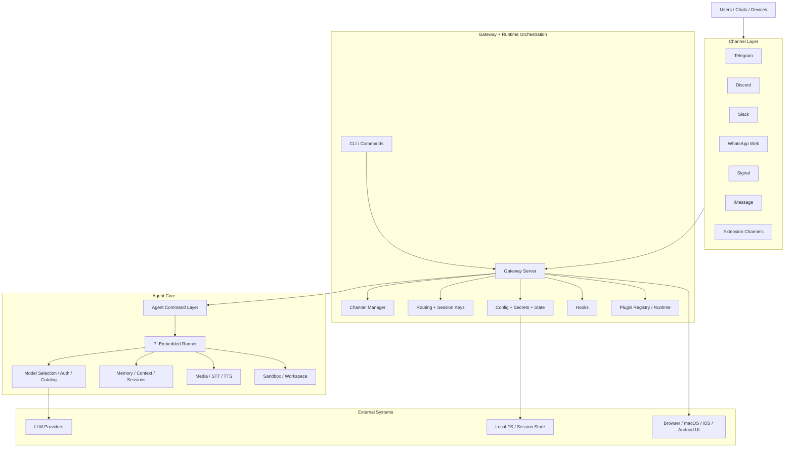

# OpenClaw 模块架构图

基于仓库主干代码的快速拆解。目标不是覆盖全部细节，而是先抓住稳定的系统边界。

## 一句话定义

OpenClaw 本质上是一个 **多渠道消息网关 + Agent 运行时 + 插件平台**。

它把 Telegram / Discord / Slack / WhatsApp Web / Signal / iMessage 等外部消息入口，统一路由到内部 Agent 与模型层，再把结果通过各渠道发回去。

## 总体架构



## 最清晰的 7 个模块

### 1. 启动与入口

- `openclaw.mjs`: Node 版本校验，跳转到构建产物入口。
- `src/entry.ts`: 真正 CLI 启动包装层，处理环境、respawn、help/version，再进入 `src/cli/run-main.js`。
- 结论：这是 **启动壳**，不是业务核心。

### 2. CLI / Commands 层

- 目录：`src/cli`, `src/commands`
- 职责：把用户命令转成系统动作，比如 agent 执行、gateway 启停、status、doctor、onboard。
- `src/commands/agent.ts` 是核心入口之一，会把一次命令送进 Agent runtime。
- 结论：这是 **控制面入口**。

### 3. Gateway 编排层

- 目录：`src/gateway`
- 代表文件：`src/gateway/server.impl.ts`, `src/gateway/server-channels.ts`
- 职责：
  - 启动 HTTP / WS / Control UI
  - 管理 channel 生命周期
  - 装配插件 runtime
  - 维护 health / reload / cron / discovery / tailscale / auth / secrets
- 结论：这是 **系统总编排器**，也是最适合继续拆分的中心层。

### 4. 渠道接入层

- 内建目录：`src/telegram`, `src/discord`, `src/slack`, `src/signal`, `src/imessage`, `src/web`
- 统一注册点：`src/channels/plugins/index.ts`
- WhatsApp Web 桥接出口：`src/channel-web.ts`, `src/channels/web/index.ts`
- `src/gateway/server-channels.ts` 负责统一 start/stop/restart 各 channel account
- 结论：这是 **适配器层**，每个渠道本质上都在做：
  - 登录/连接
  - 收消息
  - 规范化上下文
  - 发消息

### 5. 路由 / 会话 / 身份层

- 目录：`src/routing`, `src/sessions`, `src/config/sessions`
- 代表文件：`src/routing/session-key.ts`
- 职责：
  - 定义 session key 规则
  - 把 channel / account / peer / thread 归并到统一会话
  - 支撑单 agent、多 agent、群聊、线程、direct message 的上下文隔离
- 结论：这是 OpenClaw 的 **状态寻址层**，系统一致性很大程度依赖它。

### 6. Agent 运行时

- 目录：`src/agents`, `src/auto-reply`
- 核心链路：
  - `src/commands/agent.ts`
  - `src/agents/pi-embedded-runner/run.ts`
  - `src/agents/pi-embedded-runner/model.ts`
- 职责：
  - 选 provider / model
  - 准备 auth storage / model registry
  - 管理会话历史、上下文压缩、fallback、streaming
  - 执行 embedded agent / subagent / tool 调用
- 结论：这是 **AI 执行内核**。

### 7. 插件与扩展层

- 目录：`src/plugins`, `src/plugin-sdk`, `extensions/*`
- 代表文件：`src/plugins/runtime.ts`, `src/plugins/runtime/index.ts`
- 职责：
  - 维护全局 plugin registry
  - 给插件暴露 config / channel / tool / event / media / logging / model-auth 等能力
  - 让外部 extension 接入 channel、memory、diagnostics、auth、voice 等功能
- 结论：这是 **平台化边界**，也是 OpenClaw 可扩展性的关键。

## 真实主链路

```text
外部消息
-> Channel adapter
-> Gateway / Channel Manager
-> Routing / Session resolution
-> Agent command
-> PI Embedded Runner
-> Model resolve + auth
-> LLM provider
-> reply delivery
-> Channel outbound
```

## 如果要“拆解 OpenClaw”，建议先按这 4 块拆

### A. Shell / Control Plane

- `openclaw.mjs`
- `src/entry.ts`
- `src/cli`
- `src/commands`

### B. Gateway / Messaging Plane

- `src/gateway`
- `src/channels`
- `src/telegram|discord|slack|signal|imessage|web`
- `src/routing`

### C. Agent / AI Plane

- `src/agents`
- `src/auto-reply`
- `src/providers`
- `src/media-understanding`
- `src/memory`

### D. Platform / Extension Plane

- `src/plugins`
- `src/plugin-sdk`
- `extensions/*`
- `src/hooks`
- `src/config`, `src/secrets`, `src/infra`

## 我对这个项目的拆解结论

OpenClaw 不是单纯聊天机器人项目，而是一个：

1. 多入口消息总线
2. 统一会话与路由系统
3. 可插拔 Agent 执行内核
4. 可扩展渠道/能力平台

如果你的目标是继续往下拆，下一层最值得画子图的是：

- `src/gateway`
- `src/agents`
- `src/channels + 各渠道实现`
- `src/plugins / extensions`
