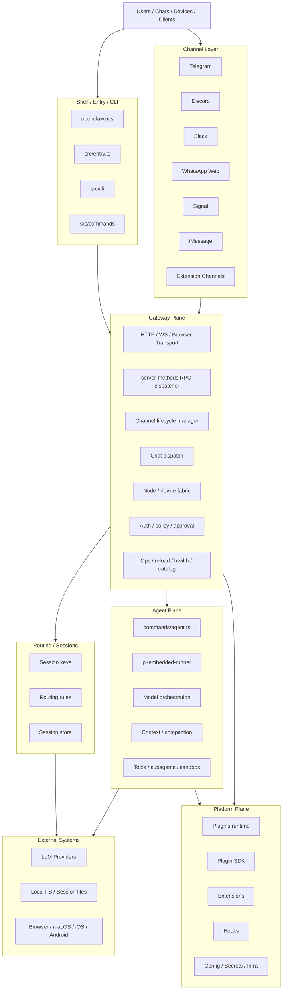
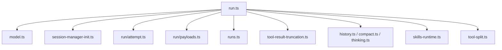
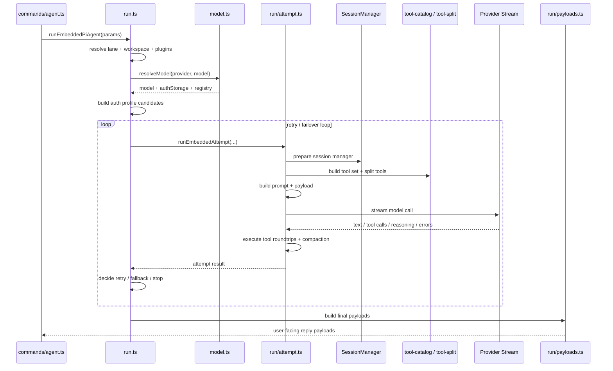

# OpenClaw, Explained: Inside a Multi-Channel Agent Runtime

At first glance, OpenClaw can be mistaken for yet another AI chat project. It speaks to users, it connects to channels, it routes prompts into models, and it sends responses back out. If you only look at the edges, it resembles a bot.

That reading does not survive contact with the codebase.

Once the codebase is examined as a system rather than as a UI surface, a very different picture appears. OpenClaw is better understood as a multi-channel messaging gateway, a unified session and routing layer, an agent execution runtime, and an extension platform living inside the same architecture. The chat experience is only the most visible part of a much larger machine.

This article is a technical walkthrough of that machine: what OpenClaw is, why it is more complex than a normal chatbot, how requests move through it, why `gateway` and `agents` form the core architectural split, and why `pi-embedded-runner` deserves to be treated as the execution kernel of the whole system.

---

## OpenClaw Is Not a Bot

The easiest way to understand OpenClaw is to start by ruling out the wrong mental model.

Most lightweight AI applications follow a simple path. They receive user input, build a prompt, call a model, and return a response. Even when they add tools or memory, the architecture often remains thin: a UI layer, some request shaping, a provider call, and a response formatter.

OpenClaw is solving a different class of problem.

It accepts ingress from multiple external surfaces, including Telegram, Discord, Slack, Signal, iMessage, WhatsApp Web, browser-facing interfaces, and local control paths. It does not merely pass those requests to a model. It normalizes them into a shared internal request space, resolves them into a unified session model, applies routing rules, chooses an execution path, runs an agent with tools and state, and then delivers the output back into the correct channel, UI, or remote node context.

That means OpenClaw is doing at least four jobs at once:

- acting as a multi-channel ingress and outbound messaging system
- maintaining a stable internal addressing model for sessions and conversations
- executing stateful, tool-enabled agent runs
- exposing a platform surface for plugins, extensions, and runtime capabilities

If there is a single sentence that captures the project, it is this:

**OpenClaw is an agent runtime system for multi-channel, multi-model, multi-tool, and increasingly multi-node execution.**

That is the right frame for the rest of the architecture.

---

## The Shape of the System

The most stable architectural view is not organized around individual files. It is organized around four planes.



The shell layer is the operational wrapper around the system. It includes `openclaw.mjs`, `src/entry.ts`, `src/cli`, and `src/commands`. Its role is not to express domain behavior; it is to absorb runtime concerns such as process startup, argument handling, environment normalization, help and version behavior, and command dispatch.

The gateway plane is where the system begins to take on its real identity. This is the orchestrator. It brings the outside world into a consistent service model. It manages transport interfaces, request dispatch, channel lifecycle, node and device presence, policy checks, and operational surfaces.

The routing and session layer exists so that OpenClaw can function as one system rather than a collection of adapters. It takes channel-specific identity and turns it into a stable internal addressing model.

The agent plane is where actual execution happens. This is the layer that decides how a run is performed, which model path is chosen, how tools are exposed, how context is managed, and how the system recovers from failure.

Under all of that sits the platform layer: plugins, SDKs, extensions, hooks, config, secrets, and infrastructure glue. This is the boundary that turns OpenClaw from an application into a host for capabilities.

Once this four-plane model is visible, the rest of the codebase becomes easier to reason about.

---

## Why the Architecture Is More Demanding Than It Looks

OpenClaw is complex for structural reasons, not accidental ones.

The system is solving several hard problems at the same time. It is not just handling multi-channel ingress. It is also trying to preserve coherent session state across those channels. It is not just calling models. It is selecting between providers, auth profiles, and fallback paths. It is not just exposing tools. It is controlling tool visibility, result safety, and provider compatibility. It is not just persisting history. It is actively repairing and protecting long-lived session state.

Those concerns overlap, and once they overlap, the project stops behaving like a normal "chat app with AI" codebase.

The key sources of complexity can be summarized in five themes.

The first is multi-entry execution. OpenClaw is not tied to a single chat surface. It can be entered through channels, UIs, HTTP APIs, WebSocket connections, and node-oriented surfaces. That already forces the architecture to separate transport from domain behavior.

The second is stateful session identity. In a multi-channel system, "who is talking to what" is not a cosmetic question. It is the foundation of correctness. If session keys are unstable or routing rules leak, context integrity collapses immediately.

The third is model orchestration. OpenClaw treats model access as a managed runtime resource, not a direct function call. It resolves providers, models, auth profiles, and fallback behavior as part of execution.

The fourth is tool-enabled action. Tools in OpenClaw are not tacked on. They are embedded into the execution engine as a first-class loop.

The fifth is long-lived reliability. The presence of session repair, write locks, transcript repair, compaction, truncation guards, and failover logic all point to the same underlying assumption: this system is expected to survive real runtime messiness.

That is why OpenClaw feels closer to an operating environment for agents than to a single bot.

---

## Following a Message Through the System

The cleanest way to explain OpenClaw is to follow one request from ingress to delivery.

At the highest level, the runtime path looks like this:

```text
External message / UI request
-> channel adapter or transport
-> gateway
-> server-methods / chat dispatch
-> routing / session resolution
-> agent ingress
-> pi-embedded-runner
-> model resolve + auth resolve
-> provider streaming + tool loop
-> payload assembly
-> outbound delivery
-> back to channel / UI / node
```

That sequence can be described in four broader movements.

The first movement is ingress. A request might arrive from Telegram, Discord, Slack, Signal, iMessage, WhatsApp Web, a CLI path, an HTTP client, a WebSocket client, a browser control surface, or a node-oriented client. All of these sources differ at the protocol and presentation level, but they must eventually converge on one internal execution path.

The second movement is gateway normalization. Inside `src/gateway`, the system establishes connection context, checks permissions, assigns request scope, resolves the handler to invoke, and converts transport-level requests into capability-level operations. This matters because the HTTP routes are not the real business API. Gateway methods are.

The third movement is session resolution. Before any agent run can begin, the system has to answer a basic question: which session does this request belong to? That is the job of routing and session-key logic. It is what lets OpenClaw keep direct messages, group threads, different accounts, and different surfaces from bleeding into each other.

The fourth movement is actual execution. The request is transformed into an agent ingress, passed into the embedded runner, resolved against models and auth profiles, executed with tool loops and context management, assembled into a user-facing payload, and then delivered outward again through the correct outbound path.

This is the core fact about OpenClaw: the system is organized around execution continuity, not around one UI or one provider.

---

## Gateway Is the System Shell

If there is one phrase that consistently describes the architecture well, it is this:

```text
gateway = system shell
agents = execution kernel
```

Start with gateway.

`src/gateway` is not the chat module. It is the composition root and service container of the runtime. It combines transport, request dispatch, channel lifecycle management, node awareness, auth and policy enforcement, health and maintenance behavior, and control-plane exposure.

The best entrypoint for understanding that structure is `src/gateway/server.impl.ts`. This file is important not because it contains the deepest business logic, but because it assembles the runtime. It loads config, sets up auth, initializes plugins, starts channels, wires transport handlers, and starts operational subsystems such as maintenance, discovery, and auxiliary sidecars.

That is the first sign that gateway is not just an API layer. It is the runtime shell of the system.

From there, the gateway plane can be split into several stable subdomains.

The transport layer includes files such as `server-http.ts`, `server-browser.ts`, `control-ui.ts`, `openai-http.ts`, and `openresponses-http.ts`. These modules expose HTTP endpoints, WebSocket handling, local browser-facing control surfaces, and compatibility APIs shaped like OpenAI interfaces. Their role is ingress and egress, not business definition.

The dispatch layer is where the real API surface lives, and that layer is `server-methods`.

The channel lifecycle layer is where channel accounts are started, stopped, monitored, and restarted.

The chat dispatch layer acts as a bridge from incoming chat semantics into the agent runtime.

The node and device fabric keeps track of runtime entities beyond the local process.

The auth and policy layer governs who can connect, what they can call, and which actions require explicit approval.

The ops layer handles maintenance concerns such as health, reloads, probes, and model catalog aggregation.

Taken together, these modules make gateway look less like an API server and more like a process shell wrapped around a distributed agent runtime.

---

## `server-methods` Is the Real API

One of the most useful architectural observations in the source materials is that HTTP and WebSocket are not the true API surface of OpenClaw. They are only transports.

The real control-plane API is `src/gateway/server-methods/*`.

That distinction matters because it changes how the system should be understood and, later, how it should be refactored.

`server-methods.ts` behaves like an RPC dispatcher. It validates method permissions, enforces role and scope checks, injects request scope, and invokes the relevant handler. This means the platform's capabilities are organized around method families rather than around URL routes.

Those method families sketch the product surface of OpenClaw more clearly than any transport layer can.

There is a connectivity and observation group, including `connect.ts`, `health.ts`, and `logs.ts`, which establishes connection state and exposes basic observability.

There is a chat and agent group, including `chat.ts`, `agent.ts`, `agent-job.ts`, `agent-wait-dedupe.ts`, and `agents.ts`. This group reveals an important split: `agent.ts` is about execution, while `agents.ts` is about managing agent entities. Those are related but not the same concern.

There is a channels and send group, including `channels.ts`, `send.ts`, `web.ts`, and `push.ts`. This family owns explicit outbound delivery, channel state inspection, and web or push bridges.

There is a nodes and devices group, including `nodes.ts`, `nodes-pending.ts`, `devices.ts`, and related helpers. This is one of the clearest signs that OpenClaw is moving beyond a single local runtime. Nodes behave like execution entities; devices behave more like pairing and authentication entities.

There is a configuration surface, through `config.ts`, `secrets.ts`, `skills.ts`, and `sessions.ts`. This gives the control plane direct reach into runtime configuration, secret resolution, installed skills, and session management.

There is an automation and voice surface through `cron.ts`, `wizard.ts`, `voicewake.ts`, `tts.ts`, and `talk.ts`, which shows that the system is trying to unify more than chat.

There is also a classic operational surface through `system.ts`, `usage.ts`, `update.ts`, and `doctor.ts`.

From an architectural perspective, the important point is simple: `server-methods` upgrades gateway from an HTTP server into a capability bus. If the codebase is ever split into packages, this layer already suggests natural boundaries such as `gateway-api-core`, `gateway-api-agent`, `gateway-api-messaging`, `gateway-api-nodes`, and `gateway-api-ops`.

Those are not arbitrary categories. They are already present in the shape of the code.

---

## Channels Are Managed Through Contracts, Not Hard-Coded Paths

It is easy to look at the concrete channel integrations and focus on Telegram, Slack, Discord, Signal, iMessage, or WhatsApp Web. Those matter, but they are not the architectural center of gravity.

The deeper abstraction is the channel contract.

OpenClaw does not appear to be designed around "if Telegram then do X, if Slack then do Y" branching inside the gateway core. Instead, gateway manages channel lifecycle through a common runtime model. The files `src/gateway/server-channels.ts`, `channel-health-monitor.ts`, and `channel-status-patches.ts` are central here.

That layer is responsible for starting and stopping channel accounts, maintaining runtime snapshots, monitoring health, applying restart and backoff behavior, and differentiating between manual stop and automatic recovery.

Notice what it is not doing: it is not carrying the full business logic of each channel protocol. That logic belongs to the channel implementation or plugin. The gateway only manages lifecycle and state against a shared contract.

That is what makes the channel system extensible. Built-in channels and extension-provided channels can fit into the same operational shell because the shell only depends on the contract, not on the protocol details.

This is one of the strongest platform signals in the codebase.

---

## Routing and Sessions Are the Hidden Backbone

There is a part of OpenClaw that is easy to underappreciate precisely because it is not flashy: routing and session identity.

But this is the hidden backbone of the system.

OpenClaw receives traffic from multiple surfaces. A single user might interact through a direct message, a group chat, a threaded conversation, a browser UI, or some remote node-assisted path. If those interactions do not resolve into the correct internal session space, then nothing above them can remain coherent.

That is why modules around `src/routing`, `src/sessions`, and `session-key.ts` matter so much. They define how channel, account, peer, thread, and context boundaries become one stable address.

This is not just bookkeeping. It is what prevents:

- one channel from leaking into another
- group context from contaminating direct context
- thread histories from overwriting each other
- reset and new-session commands from targeting the wrong state

In systems like this, session identity is correctness.

That is why OpenClaw's routing layer should be treated as infrastructure, not as glue code.

---

## The Agent Plane Is an Operating Environment

If gateway is the shell, then `src/agents` is where OpenClaw starts to behave like an operating environment.

The strongest interpretation of `src/agents` is this: it is not one feature module. It is a stack composed of an execution engine, model orchestration, context management, tool runtime, workspace and sandbox logic, sub-agent support, and identity or bootstrap infrastructure.

That claim holds up under inspection.

The entry layer includes modules such as `src/commands/agent.ts`, `src/agents/cli-runner.ts`, and `src/agents/pi-embedded.ts`. These modules accept an execution request, assemble configuration and context, and route the run into the embedded runtime.

The execution layer is the `pi-embedded-runner` family itself.

The model orchestration layer includes modules such as `model.ts`, `model-auth.ts`, `model-selection.ts`, `model-catalog.ts`, `model-fallback.ts`, and related config modules. This part of the system normalizes providers and models, constructs registries, selects auth profiles, and chooses fallback behavior. That is substantial enough to justify its own subsystem identity.

The context layer includes `context.ts`, `compaction.ts`, `context-window-guard.ts`, and `history.ts`. This is where the system decides how much state can be carried forward safely and how long sessions remain viable without overflowing their execution budget.

The tool layer includes `tool-catalog.ts`, `openclaw-tools.ts`, `tools/*`, and `channel-tools.ts`. This is one of the clearest places where OpenClaw separates itself from lightweight wrappers. The system is not merely exposing tools. It is curating and governing them.

The workspace and sandbox layer includes sub-agent modules, workspace managers, sandbox support, and concurrency lanes. That tells you the agent is not designed only for answer generation. It is designed for bounded action inside an execution environment.

Then there is the support infrastructure: agent scope, auth profiles, identity, bootstrap, and skills. These are the pieces that allow multiple configurable agents to exist inside one runtime shell.

Taken together, this is why the phrase "agent OS" is not rhetorical. It is structurally accurate.

---

## `pi-embedded-runner` Is the Execution Kernel

If the codebase has a single subsystem that deserves to be called the heart of OpenClaw, it is `src/agents/pi-embedded-runner/*`.

This is not just the place where the model call happens. It is the place where execution is made survivable.

That is the distinction worth focusing on.

At a high level, the runner combines several responsibilities that are often split across multiple systems in other projects: run orchestration, provider and model resolution, session preparation, prompt assembly, tool execution, context management, output shaping, and failure recovery.

Its core structure can be summarized like this:



`run.ts` is the outer orchestrator. It handles lifecycle, queueing, workspace resolution, plugin loading, model and profile preparation, usage tracking, and the outer failover loop.

`run/attempt.ts` is the executor for one attempt. It prepares the session manager, builds the prompt, assembles the tool surface, issues the streamed model call, and manages tool round-trips.

`model.ts` is where provider and model resolution happens. It assembles model registries, auth storage, provider normalization, and fallback behavior.

`runs.ts` tracks active runs, supports abort and wait behaviors, and manages state around run lifecycle.

The important thing is not just what each file does in isolation. It is how they cooperate to turn an unreliable environment into a controlled one.

---

## What a Run Actually Looks Like

One of the clearest ways to understand `pi-embedded-runner` is to see it as a staged execution machine.



The first stage is environment normalization. The runner selects a lane, resolves a workspace, normalizes provider and model input, and ensures the runtime plugin environment is ready.

The second stage is model resolution. Here the runner builds a usable execution target: a resolved model, an auth context, and a model registry path.

The third stage is failover preparation. Before any attempt begins, the runtime constructs auth-profile candidates, sets retry limits, initializes usage accounting, and prepares to observe failures.

The fourth stage is session safety. The attempt layer prepares the session file, initializes the session manager, repairs transcript or tool-result anomalies, and acquires write safety where needed.

The fifth stage is prompt synthesis. OpenClaw does not rely on one static system prompt. It synthesizes runtime prompts from bootstrap data, skills, hooks, channel capabilities, runtime state, and other contextual signals.

The sixth stage is tool loading. Core tools are assembled, plugin tools are attached, allowlists are applied, and the visible tool surface is transformed into whatever shape the provider-facing layer needs.

The seventh stage is streamed provider execution. Wrappers adapt provider-specific behavior, streamed output is consumed, tool calls are surfaced, and reasoning or error blocks are interpreted.

The eighth stage is the agent loop itself: tool round-trips. The model asks for a tool, the tool executes, the result is cleaned and truncated if necessary, and the model resumes.

The ninth stage is compaction and overflow recovery. When the transcript or tool outputs grow too large, the runtime compresses, trims, or retries around those constraints.

The tenth stage is outer failover. Errors are classified, auth profiles may be marked good or bad, providers or models may be swapped, and retries may be attempted.

The final stage is payload assembly. Assistant text, tool metadata, reasoning output, and user-facing error information are consolidated into the final reply object that the rest of the system can deliver.

This is why `pi-embedded-runner` deserves the label "execution kernel." It is the place where the system absorbs uncertainty and still manages to produce a coherent result.

---

## Reliability Is Designed In, Not Added Later

One of the strongest signals in OpenClaw is how much of the runtime is dedicated to defensive structure.

There is a session safety subsystem around modules such as `session-manager-init.ts`, `session-manager-cache.ts`, `session-write-lock.ts`, `session-file-repair.ts`, `session-tool-result-guard-wrapper.ts`, and `session-transcript-repair.ts`. These pieces are about protecting transcript integrity and repairing persistence anomalies before they corrupt execution.

There is a prompt assembly subsystem around `system-prompt.ts`, `skills-runtime.ts`, bootstrap logic, and attempt-level composition. This keeps prompt building dynamic rather than static.

There is a provider compatibility subsystem built from model normalization and stream wrappers. This lets OpenClaw survive the fact that providers do not agree on schema shape, tool semantics, or streaming behavior.

There is a tool safety subsystem around allowlists, context guards, truncation, and tool splitting. This ensures that tool output does not become a liability inside the context window.

There is a run-state subsystem that tracks active execution, supports abort, and coordinates when output should be flushed.

The common theme across all of these is clear: OpenClaw is engineered around the assumption that real execution is messy.

That assumption is one of the marks of a serious runtime.

---

## Why Gateway and Agents Form the Critical Boundary

The architecture becomes much easier to reason about once one boundary is made explicit:

- gateway owns ingress, orchestration, policy, lifecycle, and control-plane exposure
- agents own execution, context, tool use, model resolution, and recovery

That split is not just tidy. It is necessary.

If gateway begins to absorb too much execution logic, transport concerns and execution concerns get entangled. If the agent plane becomes too aware of transport details, the runtime becomes harder to reuse and harder to stabilize.

In other words, OpenClaw works best when gateway remains the shell and agents remain the kernel.

This is also why future refactoring directions are already visible.

On the gateway side, the method families suggest package boundaries such as `gateway-api-core`, `gateway-api-agent`, `gateway-api-messaging`, `gateway-api-nodes`, and `gateway-api-ops`.

On the runner side, `pi-embedded-runner` suggests boundaries such as `runner-core`, `runner-attempt`, `runner-session`, `runner-provider-compat`, `runner-context`, and `runner-prompt`.

At a higher level, the agent plane could be decomposed into `agent-runtime`, `model-orchestration`, `tool-runtime`, `session-runtime`, and `subagent-sandbox`.

Those are not speculative architecture diagrams imposed from outside. They are boundaries already latent in the system as it exists.

---

## The Best Way to Read the Codebase Next

If the goal is to continue understanding OpenClaw from the inside, the next files worth studying depend on what question is being asked.

If the question is, "How does the system organize the outside world?" the most useful files are:

- `src/gateway/server.impl.ts`
- `src/gateway/server-methods.ts`
- `src/gateway/server-channels.ts`
- `src/gateway/server-chat.ts`
- `src/gateway/auth.ts`

If the question is, "How does one agent run actually happen?" the most useful files are:

- `src/commands/agent.ts`
- `src/agents/pi-embedded-runner/run.ts`
- `src/agents/pi-embedded-runner/run/attempt.ts`
- `src/agents/pi-embedded-runner/model.ts`
- `src/agents/tool-catalog.ts`

The first group explains control and orchestration. The second explains execution.

Together, they explain why OpenClaw feels more like a runtime environment than like an app.

---

## Final Reading

OpenClaw is easy to underestimate if it is approached through its chat surfaces. It starts to make sense only when viewed from the inside out.

It is not just a bot. It is not merely an AI gateway. It is not simply a model wrapper with channels attached.

It is a system that brings many entrypoints into one runtime shell, resolves those requests into a stable session model, executes them through an agent kernel with tools and recovery behavior, and exposes enough extension structure to keep evolving.

The shortest accurate summary is probably this:

**OpenClaw is a multi-entry, multi-model, multi-tool, increasingly multi-node agent runtime system.**

Or, put more bluntly:

```text
OpenClaw is not a bot.
It is an operating environment for agents.
```
