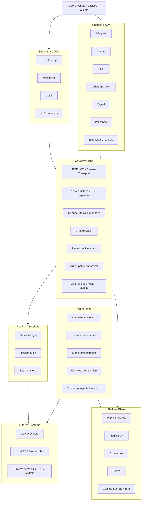
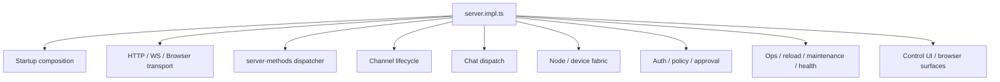
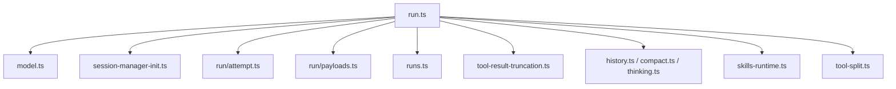
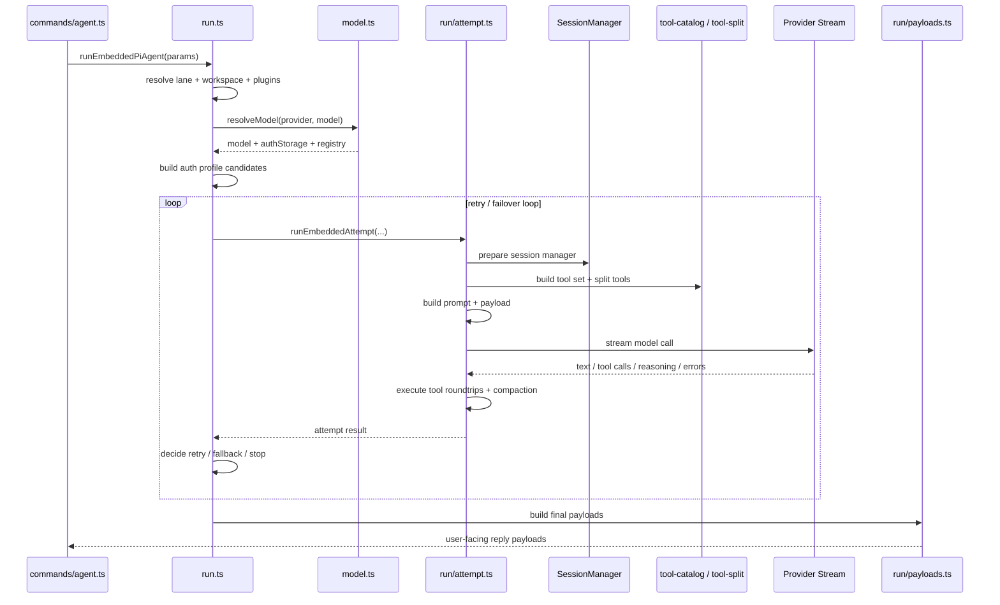

# OpenClaw 全景长文拆解

这篇文档把仓库里现有的 5 份 OpenClaw 分析文档合并成一篇连续长文，目标不是简单拼接，而是把它们统一成一条更容易阅读的主线：

1. OpenClaw 到底是什么
2. 它为什么不是普通聊天机器人
3. 它的系统边界与核心分层是什么
4. 一条消息进入系统后，到底经过了哪些模块
5. `gateway` 和 `agents` 这两个核心面分别承担什么职责
6. `server-methods` 为什么是整个 control plane 的 API 面
7. `pi-embedded-runner` 为什么可以视为 OpenClaw 的执行内核
8. 如果继续重构或拆包，最合理的边界在哪里

---

## 一、先给结论：OpenClaw 到底是什么

一句话说清楚：

**OpenClaw 本质上是一个多渠道消息网关、一个统一会话与路由系统、一个可插拔 Agent 执行内核，以及一个扩展平台的组合体。**

如果再压缩成更工程化的表达，它可以被理解成四层能力的叠加：

- 外部世界的消息接入层
- 中间的 gateway 编排与控制层
- 内部的 agent 执行层
- 底部的平台能力与扩展层

这也是为什么 OpenClaw 很容易被误判。表面上看，它确实能做“聊天”。但从仓库结构和模块职责看，它早就不是一个“把消息转给 LLM，再把答案发回去”的薄封装项目。

它真正做的是：

- 统一接 Telegram、Discord、Slack、Signal、iMessage、WhatsApp Web 等多种入口
- 用统一的 session key 和 routing 规则把不同渠道、不同账号、不同会话线程规整到内部状态空间
- 通过 gateway 暴露 HTTP / WS / Browser / OpenAI 风格接口
- 通过 `agent` 命令和 embedded runner 真正执行一次 AI run
- 在执行期间处理模型解析、认证选择、streaming、tool call、上下文压缩、失败恢复
- 最后把结果回送到 UI、聊天渠道或远端节点

所以如果用一句更有辨识度的话来概括：

**OpenClaw 不是聊天机器人，而是一个面向多渠道、多节点、多模型、多工具执行场景的 Agent Runtime System。**

---

## 二、五份文档统一之后，最稳的总体视图

把五份文档的结论叠起来，可以得到一个比较稳定的系统拓扑。



从这个视图出发，OpenClaw 最值得记住的不是零散文件名，而是四个平面：

### 1. Shell / Control Plane

这部分是启动壳和控制入口，包括：

- `openclaw.mjs`
- `src/entry.ts`
- `src/cli`
- `src/commands`

它负责把 CLI、环境变量、help/version、respawn 等运行层问题屏蔽掉，把用户动作变成系统动作。

### 2. Gateway / Messaging Plane

这部分是整个系统的中心编排器，包括：

- `src/gateway`
- `src/channels`
- 各渠道实现
- `src/routing`
- `src/sessions`

它负责把外部世界接进来，并把内部能力组织成统一服务。

### 3. Agent / AI Plane

这部分是 OpenClaw 的执行内核，包括：

- `src/agents`
- `src/auto-reply`
- `src/providers`
- `src/memory`
- `src/media-understanding`
- `src/tts`

它真正决定一次 agent run 如何发生。

### 4. Platform / Extension Plane

这部分是平台化边界，包括：

- `src/plugins`
- `src/plugin-sdk`
- `extensions/*`
- `src/hooks`
- `src/config`
- `src/secrets`
- `src/infra`

它决定 OpenClaw 能不能从一个系统演化成一个平台。

---

## 三、为什么说 OpenClaw 不是“普通聊天项目”

如果把很多常见 AI 应用简化，主链路通常只有这几步：

1. 接收用户输入
2. 拼 prompt
3. 调模型
4. 返回结果

而 OpenClaw 在五份文档里反复显现出的复杂度，来自它同时在解决至少五类问题：

1. 多渠道消息接入与回发
2. 统一会话寻址与状态隔离
3. Agent 工具执行与子代理协作
4. 多 provider、多 profile、多模型的兼容与 failover
5. 长会话、长上下文、长生命周期下的稳定运行

这意味着它的复杂度不是来自“代码多”，而是来自“要解决的问题堆叠得多”。尤其是下面这些特征，把它和普通 bot 项目完全区分开了：

### 多入口而不是单入口

系统并非只面向一个 Web Chat UI，而是同时面向：

- 聊天渠道
- 本地控制 UI
- HTTP / WS 客户端
- Browser surfaces
- mobile / node clients

### 多运行实体而不是单进程问答

从 `nodes.ts`、`devices.ts`、`node-registry.ts`、`server-discovery.ts` 这些模块可以看出，OpenClaw 已经具备明显的“多节点 agent fabric”倾向。

也就是说，系统不是只有一个本地 agent 在回答问题，而是在管理：

- 哪些 node 在线
- 哪些 device 已配对
- 哪些请求需要下发到远端节点
- 哪些 pending work 需要排队和唤醒

### 多模型编排而不是单次 API 调用

`model.ts`、`model-selection.ts`、`model-fallback.ts`、`model-auth.ts` 这一整条线说明，OpenClaw 把模型调用看成“可编排资源”，而不是单个 API endpoint。

系统不仅要决定“调哪个模型”，还要决定：

- 用哪个 provider
- 走哪个 auth profile
- 遇到错误时换 profile 还是换 provider
- 某些 pass-through provider 如何做兼容
- 某些 forward-compatible 模型如何回退

### 工具系统是内核能力，不是附件

`tool-catalog.ts`、`openclaw-tools.ts`、`tool-split.ts`、`tools/*` 这些模块说明，工具调用不是后加的 feature，而是运行时中心能力。

OpenClaw 明确把工具 surface、工具 allowlist、工具结果截断、上下文污染防护都握在自己手里。这是一个典型的“我不信任底层 provider 能帮我处理好工具生命周期”的系统设计。

### 会话和持久化是核心，不是临时变量

从 `session-manager-init.ts`、`session-file-repair.ts`、`session-transcript-repair.ts`、`session-write-lock.ts` 可以看出，OpenClaw 很清楚长期运行系统里最容易坏掉的不是 prompt，而是状态一致性。

它专门做了一层“会话修补与保护”子系统，这说明它面对的是持续性 Agent，而不是一次性 demo。

---

## 四、OpenClaw 的主链路：一条消息到底怎么跑完整个系统

如果把五份文档压缩成一条最真实的业务链路，可以写成：

```text
外部消息 / UI 请求
-> channel adapter 或 transport
-> gateway
-> server-methods / chat dispatch
-> routing / session resolution
-> agent ingress
-> pi-embedded-runner
-> model resolve + auth resolve
-> provider streaming + tool loop
-> payload assembly
-> outbound delivery
-> 回到聊天渠道 / UI / 节点
```

这个链路里，每一跳都很关键。

### 阶段 1：入口接收

入口来源可能是：

- Telegram / Discord / Slack / Signal / iMessage / WhatsApp Web
- CLI 命令
- HTTP API
- WebSocket
- Browser / Control UI
- Node / mobile client

这些入口看起来很多，但在 gateway 里会被逐渐规整成统一的内部请求。

### 阶段 2：Gateway 接管

一旦进入 `src/gateway`，系统会开始做几件标准化工作：

- 建立连接上下文
- 做鉴权和 role/scope 校验
- 做 request scope 注入
- 选择对应 method handler
- 把 transport 请求翻译成内部 capability 调用

这一层的重要性在于：OpenClaw 的“业务 API”并不等于 HTTP endpoint，而真正体现在 `server-methods/*` 这一层。

### 阶段 3：Routing 与 Session 归一化

在真正执行 agent 之前，系统必须先回答一个问题：

**这条消息到底属于哪个会话？**

这时 `src/routing`、`src/sessions`、`session-key.ts` 这类模块开始起作用。它们负责根据：

- channel
- account
- peer
- thread
- direct/group 上下文

把不同世界的消息落到统一 session space。

这一步非常关键，因为如果 session key 设计不稳定，多渠道系统的上下文会立刻失控。

### 阶段 4：Gateway 到 Agent 的翻译

在 `server-methods/agent.ts` 或 `server-chat.ts` 这类模块中，gateway 会把上游请求翻译成 agent ingress。

这里做的事情通常包括：

- 校验参数
- 规范化 sessionKey / agentId / metadata
- 解析文本与附件
- 处理 `/new`、`/reset`
- 去重和幂等保护
- 调用 `agentCommandFromIngress`

这里再次说明，gateway 并不执行 agent，它只是负责“把一次外部请求翻译成一次可执行的 agent run”。

### 阶段 5：Agent Runtime 真正开始

进入 `src/commands/agent.ts` 后，请求会被推进到 `pi-embedded-runner`。

从这里开始，系统正式进入“执行态”。这一部分是 OpenClaw 最值得深入理解的核心，因为它同时管理：

- run 生命周期
- provider / model 解析
- auth profile 选择
- session manager
- tool loop
- compaction
- retry / failover
- usage 汇总

### 阶段 6：结果回流

run 完成后，系统还不能直接返回字符串。它还要：

- 汇总 assistant texts
- 汇总 tool meta
- 处理 reasoning block
- 处理错误去重
- 生成用户可见的 reply payload
- 决定如何 outbound delivery

最终这条消息会重新流向：

- 某个渠道
- 某个 UI
- 某个 node / device
- 某个浏览器 surface

---

## 五、Gateway Plane：OpenClaw 的系统编排中心

五份文档里，`src/gateway` 是出现频率最高的一个焦点，因为它是整个系统的 composition root 和 control center。

最准确的一句话是：

**`src/gateway` 不是聊天模块，而是一个把 transport、RPC methods、channel runtime、node registry、auth、ops 合在一起的服务容器。**

### 1. Gateway 的二级结构

按职责边界，它至少可以稳定拆成下面这些模块：



下面逐块看。

### 2. 启动装配模块

核心文件是 `src/gateway/server.impl.ts`。

这一层最像后端系统里的 composition root。它负责：

- 加载配置
- 初始化 auth
- 初始化 plugin runtime
- 加载 gateway plugins
- 启动 channel manager
- 挂接 HTTP / WS / browser handlers
- 启动 cron、maintenance、discovery、heartbeat、sidecars

也就是说，`server.impl.ts` 不是“业务逻辑中心”，而是“模块装配中心”。

### 3. Transport 模块

关键文件包括：

- `server-http.ts`
- `server-browser.ts`
- `control-ui.ts`
- `openai-http.ts`
- `openresponses-http.ts`

这一层是对外通信的入口，但它本身并不定义业务能力。它负责的是：

- 暴露 HTTP API
- 暴露 WebSocket gateway
- 提供本地 control UI
- 提供 OpenAI 风格兼容接口
- 承接 browser/client 请求

这层可以理解成 gateway 的 ingress/egress transport。

### 4. `server-methods` 模块：真正的 API 面

五份文档里最重要的洞察之一就是：

**HTTP / WS 只是入口，`src/gateway/server-methods/*` 才是 OpenClaw gateway 的真实 API surface。**

`server-methods.ts` 本质上是一个 RPC dispatcher。它做四件事：

1. 校验 method 权限
2. 做 role / scope 校验
3. 套 request scope
4. 调用具体 handler

所以如果有人问“gateway 暴露了什么能力”，正确答案应该从 `server-methods/*` 出发，而不是从某几个 HTTP endpoint 出发。

### 5. `server-methods` 的方法族

把文档中的分类统一后，`server-methods/*` 至少可以分成以下几组。

#### 5.1 连接与观测

- `connect.ts`
- `health.ts`
- `logs.ts`

这组方法负责：

- 建立连接上下文
- 处理握手与 metadata
- 暴露健康探针
- 提供日志尾流

它们构成最基础的 control plane 观测入口。

#### 5.2 Chat / Agent

- `chat.ts`
- `chat-transcript-inject.ts`
- `attachment-normalize.ts`
- `agent.ts`
- `agent-job.ts`
- `agent-wait-dedupe.ts`
- `agents.ts`

这一组里有一个非常重要的区分：

- `agent.ts` 是执行入口
- `agents.ts` 是 agent 实体管理入口

前者负责“跑一次 agent”，后者负责“增删改查 agent 配置和文件”。

而 `chat.ts` 则更像面向 WebChat / UI 的聊天会话服务。

#### 5.3 Channels / Send

- `channels.ts`
- `send.ts`
- `web.ts`
- `push.ts`

这一组负责：

- 查询渠道状态
- 启停或登出渠道
- 显式发送 outbound 消息
- 处理 web / push 相关桥接

特别是 `send.ts`，它更像 outbound service façade，因为它要做：

- target 解析
- session route 推导
- channel resolution
- 真正的 outbound deliver

#### 5.4 Nodes / Devices

- `nodes.ts`
- `nodes-pending.ts`
- `nodes.helpers.ts`
- `nodes.handlers.invoke-result.ts`
- `devices.ts`

这组模块说明 OpenClaw 已经不只是聊天系统，而是在管理：

- node list / rename / describe
- pairing request / approve / reject / verify
- invoke / event / pending queue
- device token 和配对生命周期

这里还揭示了一个关键抽象：

- node 更像运行实体
- device 更像认证和配对实体

#### 5.5 Config / Secrets / Skills / Sessions

- `config.ts`
- `secrets.ts`
- `skills.ts`
- `sessions.ts`

这组方法构成运行时控制台：

- 改配置
- 解析密钥
- 管理 skills
- 管理 session store

尤其 `sessions.ts` 很重要，因为它把统一会话系统直接暴露给了 control plane。

#### 5.6 Automation / Voice / Wizard

- `cron.ts`
- `wizard.ts`
- `voicewake.ts`
- `tts.ts`
- `talk.ts`

这些能力表明 OpenClaw 不是单功能系统，而是试图把 onboarding、自动化、语音唤醒、语音合成、talk mode 都纳入统一控制面。

#### 5.7 System / Usage / Update / Doctor

- `system.ts`
- `usage.ts`
- `update.ts`
- `doctor.ts`

这组是典型运维控制面，用来处理：

- 系统级状态
- 成本和用量
- 更新流程
- 诊断逻辑

#### 5.8 Browser / Tools Catalog / Validation 辅助

- `browser.ts`
- `tools-catalog.ts`
- `validation.ts`
- `base-hash.ts`

这一层看起来像辅助模块，但其实很关键。它决定：

- 外部 client 能看见哪些工具目录
- gateway 如何对输入做一致性和安全处理

### 6. 为什么 `server-methods` 是 control-plane API surface

从工程视角看，`server-methods/*` 的意义是把 gateway 从一个“HTTP server”升级成了一个“capability bus”。

换句话说：

- transport 只是把请求运进来
- `server-methods` 才定义了系统到底能做什么

如果未来要拆包，这一层几乎天然可以重构为：

- `gateway-api-core`
- `gateway-api-agent`
- `gateway-api-messaging`
- `gateway-api-nodes`
- `gateway-api-ops`

这是一个非常干净的演化方向。

---

## 六、Channel Lifecycle 与 Channel Plugin Plane：消息系统的骨架

很多人看 OpenClaw 会先盯着 Telegram、Slack、Discord 这些目录，但真正更关键的是：

**系统并不是把各渠道硬编码接进去，而是用统一 contract 管渠道生命周期。**

### 1. 生命周期管理层

关键文件包括：

- `src/gateway/server-channels.ts`
- `src/gateway/channel-health-monitor.ts`
- `src/gateway/channel-status-patches.ts`

这一层负责：

- 启动 channel account
- 停止 channel account
- 维护 runtime snapshot
- 监控状态
- 做 restart / backoff
- 区分 manual stop 和 auto recovery

重点在于，这里不关心 Telegram 或 Slack 的业务细节，只关心：

- 一个渠道实例怎么被拉起
- 崩了怎么恢复
- 当前状态如何暴露给上层

### 2. Channel Plugin Plane 的意义

五份文档共同指向一个结论：

**OpenClaw 的渠道抽象核心不在某个具体渠道，而在统一 channel contract。**

这意味着 gateway 依赖的不是 Telegram、Slack、Discord 这些具体实现，而是它们共同实现的接口能力。

这种设计有两个直接收益：

1. 内建渠道和外部 extension 可以站在同一层面接入系统
2. gateway 可以只管理生命周期和状态，而不深入具体协议细节

这就是平台化设计的典型特征。

---

## 七、Routing / Sessions：OpenClaw 的状态寻址层

如果说 channel plane 解决的是“消息从哪里来”，那 routing / sessions 解决的是“消息落到哪里去”。

这一层很容易被低估，但它其实是整个系统一致性的基础。

关键职责包括：

- 定义 session key 规则
- 把 channel/account/peer/thread 规整为统一寻址方式
- 支撑 direct message、group、thread、多 agent 场景的上下文隔离
- 让 UI chat、聊天渠道、node request 共享内部状态空间

这一层的重要性在于：

OpenClaw 是多入口系统。如果没有统一 session addressing，系统会立刻出现以下问题：

- 同一用户在不同渠道上下文错串
- 群聊和私聊上下文污染
- 不同 thread 互相覆盖历史
- agent reset/new 无法精确作用于正确会话

因此，`src/routing/session-key.ts` 这一类文件虽然不显眼，却是整套系统能否稳定运行的基础设施。

---

## 八、Agents Plane：OpenClaw 的 AI Runtime Core

五份文档对 `src/agents` 的判断很一致：

**它不是单一模块，而是一个由执行引擎、模型编排、工具系统、上下文管理、子代理与沙箱组成的完整 agent OS。**

这句话非常准确。因为 `src/agents` 里至少叠了下面七层职责。

### 1. Agent 入口层

关键模块：

- `src/commands/agent.ts`
- `src/agents/cli-runner.ts`
- `src/agents/pi-embedded.ts`

这层负责接收一次 agent 调用，并组装：

- config
- session
- model
- workspace
- secret context

最后把它们送进 embedded runner。

### 2. 执行引擎层

关键模块：

- `src/agents/pi-embedded-runner/run.ts`
- `src/agents/pi-embedded-runner/run/attempt.ts`
- `src/agents/pi-embedded-runner/runs.ts`

这是 AI runtime 的核心执行器。它负责：

- run 生命周期
- streaming
- abort
- lane queue
- usage
- tool result 汇总

### 3. 模型编排层

关键模块：

- `model.ts`
- `model-auth.ts`
- `model-selection.ts`
- `model-catalog.ts`
- `model-fallback.ts`
- `models-config*.ts`

这层负责：

- provider / model 规范化
- 模型目录构建
- auth profile 选择
- fallback 决策
- 对 OpenRouter、Copilot、Gemini、Bedrock、Ollama 等来源做兼容

它几乎可以单独被视为一个 `model orchestration subsystem`。

### 4. 上下文与压缩层

关键模块：

- `context.ts`
- `compaction.ts`
- `context-window-guard.ts`
- `history.ts`

这层负责：

- 历史消息窗口控制
- 长上下文压缩
- 上下文爆窗保护
- 长会话的可持续执行

### 5. 工具与能力层

关键模块：

- `tool-catalog.ts`
- `openclaw-tools*.ts`
- `tools/*`
- `channel-tools.ts`

这层负责：

- 注册核心工具
- 组织 browser、pdf、memory、image、session、cron、channel actions 等能力
- 对工具结果做策略、展示和清洗

这是 OpenClaw 区别于普通 LLM wrapper 的重要分界。

### 6. Subagent / Workspace / Sandbox 层

关键模块：

- `subagent-*`
- `workspace*.ts`
- `sandbox/*`
- `lanes.ts`

这层说明 agent 不只是“回答问题”，而是有明确的操作型 runtime 特征：

- 管多 agent / 子 agent 边界
- 管工作目录
- 管文件桥接、沙箱、browser、docker
- 管并发 lane

### 7. 身份与配置附属层

关键模块：

- `agent-scope.ts`
- `auth-profiles/*`
- `identity*.ts`
- `bootstrap-*`
- `skills*`

这层负责：

- agent scope
- persona / identity
- auth profiles
- bootstrap context
- skills 快照与刷新

它支撑了“同一运行时里有多个可配置 agent”的能力。

---

## 九、`pi-embedded-runner`：OpenClaw 最值得细拆的执行内核

如果整个系统里必须只选一个最值得深入理解的模块，那就是：

`src/agents/pi-embedded-runner/*`

五份文档对它的判断几乎一致：

**它不是一个“调用 LLM 的函数”，而是一个带重试、带 fallback、带工具回路、带上下文压缩、带 provider 兼容层的 agent 执行引擎。**

也可以更进一步说：

如果 `gateway` 是 system shell，
那 `pi-embedded-runner` 就是 OpenClaw 的微型执行内核。

### 1. 主文件职责图



### 2. 四个最关键角色

#### `run.ts`

这是外层 orchestrator。它负责：

- 整个 run 生命周期
- lane queue
- workspace 解析
- runtime plugins 加载
- provider / model / profile 解析
- failover 主循环
- usage 汇总

#### `run/attempt.ts`

这是单次 attempt 执行器。它负责：

- 构造 system prompt
- 准备 session manager
- 准备工具集
- 构造 payload
- 发起一次模型流式执行
- 处理 tool call roundtrip

#### `model.ts`

这是模型解析层。它负责：

- provider / model 解析
- inline provider 配置合成
- auth storage / model registry 组装
- forward-compat fallback

#### `runs.ts`

这是运行状态注册表。它负责：

- active run 跟踪
- abort
- wait end
- embedded message queue

### 3. 执行时序：一次 run 是怎么完成的

五份文档合并后，最完整的时序可以表达为：



### 4. 按阶段详细拆一次

#### 阶段 1：入口标准化

发生在 `run.ts`。

内容包括：

- 选择 lane
- 选择 workspace
- 归一化 provider / model
- 确保 runtime plugins 已加载

这一阶段决定了“这次 run 在什么执行环境中发生”。

#### 阶段 2：模型解析

发生在 `model.ts`。

内容包括：

- 读取 provider/model 配置
- 查询 model registry
- 处理 inline provider models
- 处理 forward-compatible fallback
- 处理 pass-through provider 特判

产物包括：

- resolved model
- auth storage
- model registry

#### 阶段 3：外层失败恢复准备

回到 `run.ts`。

这里 runner 会：

- 构造 auth profile 候选序列
- 计算最大 retry iterations
- 准备 usage accumulator
- 准备 failover observation

这一步意味着 OpenClaw 的执行器不是被动调用模型，而是在主动寻找“可运行路径”。

#### 阶段 4：单次 attempt 初始化

发生在 `run/attempt.ts`。

内容包括：

- 准备 session file
- 初始化 session manager
- 修补 transcript / tool result pairing
- 获取 session write lock

这一层的核心目标不是智能，而是安全执行。

#### 阶段 5：Prompt 合成

仍然发生在 `run/attempt.ts` 及其相关模块。

这里 system prompt 不是静态模板，而是多来源合成：

- bootstrap context
- skills prompt
- hooks
- channel capability hints
- runtime state
- owner / docs / TTS 等辅助信息

这说明 OpenClaw 的 prompt system 更像“运行时拼装器”，而不是固定文案。

#### 阶段 6：工具装载

主要涉及：

- `openclaw-tools.ts`
- `tool-split.ts`
- `tool-catalog.ts`
- `run/attempt.ts`

这一阶段做的事情包括：

- 注册核心工具
- 追加 plugin tools
- 套 allowlist
- 转成 provider / SDK 可消费的 tool definitions

一个很关键的点是：文档明确指出 `tool-split.ts` 当前把工具都走 `customTools`，而不是走 provider 内建工具。

这说明 OpenClaw 明确选择“工具生命周期自己掌控”。

#### 阶段 7：Provider Stream 执行

这一阶段 runner 会：

- 选择 stream function
- 套 provider wrapper
- 处理 provider-specific compatibility
- 流式接收文本、tool calls、reasoning block、错误

相关兼容层包括：

- `anthropic-stream-wrappers.ts`
- `openai-stream-wrappers.ts`
- `proxy-stream-wrappers.ts`
- `moonshot-stream-wrappers.ts`
- `google.ts`

这表明 OpenClaw 在 provider 差异面前选择的是“自己做统一兼容层”。

#### 阶段 8：Tool Roundtrip

这是 agent 能行动的关键闭环。

过程很直接：

1. 模型发起 tool call
2. 系统执行工具
3. 工具结果被清洗、截断、回注 transcript
4. 模型再次继续执行

没有这个回路，OpenClaw 只是聊天系统；有了这个回路，它才是 agent runtime。

#### 阶段 9：Compaction / Overflow Recovery

相关模块包括：

- `compact.ts`
- `history.ts`
- `tool-result-truncation.ts`
- compaction timeout 相关模块

这一步是在处理长会话系统最棘手的问题：

- 上下文过大
- 图片历史过多
- tool result 过长
- compaction 本身可能超时

可以说这是长会话稳定性的关键补偿系统。

#### 阶段 10：外层 Failover

再次回到 `run.ts`。

此时 runner 会判断：

- 错误类型是什么
- 当前 auth profile 是否应标记为 good / bad
- 是否切换 profile / provider / model
- 是否 backoff 后重试

这一步赋予了执行器“自恢复”特征。

#### 阶段 11：结果成型

最后由 `run/payloads.ts` 等模块完成：

- 汇总 assistant texts
- 汇总 tool metas
- 决定 reasoning 如何展示
- 清洗 raw error
- 生成最终 reply payloads

这一步相当于 UI-facing result assembler。

### 5. 内部子系统视角

把 `pi-embedded-runner` 再抽象一次，可以看到它内部至少有五个重要子系统。

#### 5.1 会话安全子系统

相关模块：

- `session-manager-init.ts`
- `session-manager-cache.ts`
- `session-write-lock.ts`
- `session-file-repair.ts`
- `session-tool-result-guard-wrapper.ts`
- `session-transcript-repair.ts`

职责：

- 保护 transcript 一致性
- 修补外部库持久化怪癖
- 防止 tool result 污染会话文件

#### 5.2 Prompt 合成子系统

相关模块：

- `system-prompt.ts`
- `skills-runtime.ts`
- `bootstrap-*`
- `run/attempt.ts`

职责：

- 组装 system prompt
- 注入 skills / bootstrap / channel / runtime context

#### 5.3 Provider 兼容子系统

相关模块：

- `model.ts`
- `model.provider-normalization.ts`
- 各类 stream wrappers

职责：

- 兼容不同 provider 的 schema、streaming、tool-call 行为

#### 5.4 Tool 安全子系统

相关模块：

- `tool-name-allowlist.ts`
- `tool-result-context-guard.ts`
- `tool-result-truncation.ts`
- `tool-split.ts`

职责：

- 限制可调用工具
- 防止工具结果污染上下文
- 控制 provider 可见工具面

#### 5.5 Run 状态子系统

相关模块：

- `runs.ts`
- `abort.ts`
- `wait-for-idle-before-flush.ts`
- `usage-reporting.ts`

职责：

- 跟踪活动 run
- 提供 abort / wait
- 在正确时机 flush 结果
- 汇总 usage

### 6. 为什么它这么复杂

因为它同时在解决五类问题：

1. 模型调用
2. 工具调用
3. 会话持久化
4. provider 兼容
5. 长上下文稳定性

绝大多数 agent 项目只做前两项，少数会做第三项，更少的会对第四和第五项做系统级处理。

OpenClaw 的复杂度，本质上就来自这里。

---

## 十、Gateway 与 Agents 的关系：Shell 与 Kernel

五份文档里有一个非常好的比喻：

```text
gateway = system shell
agents = execution kernel
```

这个比喻基本抓住了系统本质。

### `gateway` 负责什么

- 接入
- 编排
- 鉴权
- 分发
- 生命周期管理
- 运行状态暴露
- control plane API

### `agents` 负责什么

- 真正执行 AI 会话
- 选模型
- 管工具
- 管上下文
- 管 session transcript
- 管 failover
- 管运行时安全

换句话说：

- gateway 解决“请求怎么进来、怎么被安排、怎么被管控”
- agents 解决“这次智能执行到底怎么发生”

这两个面拆得越清楚，系统越容易维护。反过来说，如果未来代码开始让 gateway 混入大量执行逻辑，或者让 agents 直接耦合太多 transport 细节，系统边界就会被破坏。

---

## 十一、如果继续拆解 OpenClaw，最值得先看的文件

基于五份文档的共同判断，继续深入时优先级最高的文件大概如下。

### Gateway 方向

- `src/gateway/server.impl.ts`
- `src/gateway/server-methods.ts`
- `src/gateway/server-channels.ts`
- `src/gateway/server-chat.ts`
- `src/gateway/auth.ts`

### Agents 方向

- `src/commands/agent.ts`
- `src/agents/pi-embedded-runner/run.ts`
- `src/agents/pi-embedded-runner/run/attempt.ts`
- `src/agents/pi-embedded-runner/model.ts`
- `src/agents/tool-catalog.ts`

如果目标是理解“为什么它能跑”，看第二组。

如果目标是理解“为什么它能接这么多东西还能管住”，看第一组。

---

## 十二、如果未来要重构，哪些拆包方向最合理

五份文档其实都隐含了一个共同方向：OpenClaw 现在已经具备很强的包化潜力。

### 1. Gateway 侧

最自然的拆法是：

- `gateway-api-core`
- `gateway-api-agent`
- `gateway-api-messaging`
- `gateway-api-nodes`
- `gateway-api-ops`

因为 `server-methods/*` 本身已经按能力域形成了清晰边界。

### 2. Runner 侧

`pi-embedded-runner` 最自然的拆法是：

- `runner-core`
- `runner-attempt`
- `runner-session`
- `runner-provider-compat`
- `runner-context`
- `runner-prompt`

这种拆法既符合现有职责边界，也有利于测试隔离。

### 3. Agents 总体侧

更高层的拆法可以是：

- `agent-runtime`
- `model-orchestration`
- `tool-runtime`
- `session-runtime`
- `subagent-sandbox`

### 4. Channel 侧

渠道部分则可以继续强化 contract-first 方向：

- `channel-contract`
- `channel-runtime-manager`
- `channel-plugins-builtin`
- `channel-plugins-extensions`

这会让平台化更加彻底。

---

## 十三、最终总结：如何一句话理解 OpenClaw

如果把这五份文档合并后只留下最后一段话，我会这样概括：

**OpenClaw 是一个把多渠道消息接入、统一会话路由、gateway 控制面、agent 执行内核、工具系统、模型编排、节点能力和扩展平台揉在一起的 Agent Operating Runtime。**

进一步拆成三句更好记的话：

1. `gateway` 负责把世界接进来，并把系统能力组织成 control plane。
2. `agents` 负责让一次 AI run 真正安全、稳定、可恢复地执行完。
3. `pi-embedded-runner` 则是整个系统里最接近“执行内核”的部分。

如果再用最短的话收尾：

```text
OpenClaw 不是 bot。
OpenClaw 也不是单纯的 AI gateway。
OpenClaw 更像一个多入口、多模型、多工具、多节点的 Agent Runtime OS。
```

---

## 附：本长文整合的源文档

- `openclaw-architecture.md`
- `openclaw-core-decomposition.md`
- `openclaw-server-methods-map.md`
- `openclaw-pi-embedded-runner-sequence.md`
- `openclaw-detailed-module-breakdown.md`
