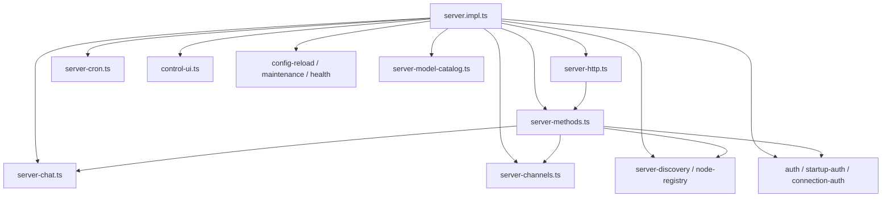
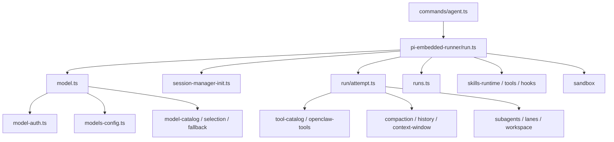

# OpenClaw 二级拆解

只展开两个核心面：`src/gateway` 和 `src/agents`。

## 1. `src/gateway` 的二级结构

### 定位

`gateway` 是系统编排层，不直接承载模型推理细节，而是负责把：

- 外部连接
- 控制接口
- 渠道运行时
- Agent 调用
- 节点/设备
- 鉴权/密钥

拼成一个统一服务。

### 子模块图



### 可以稳定划分成 6 块

#### A. 启动装配

- 核心：`src/gateway/server.impl.ts`
- 作用：装配整个 gateway runtime
- 包含：
  - config 加载
  - auth 初始化
  - plugin runtime 注入
  - channel manager 启动
  - hooks / cron / health / ws / browser sidecar

这是 `gateway` 的 composition root。

#### B. 传输层

- `src/gateway/server-http.ts`
- `src/gateway/server-browser.ts`
- `src/gateway/control-ui.ts`
- `src/gateway/openai-http.ts`
- `src/gateway/openresponses-http.ts`

作用：

- 对外暴露 HTTP / WS / Control UI
- 提供 OpenAI 兼容接口
- 提供浏览器控制面接入

这层可以理解为 `gateway ingress/egress transport`。

#### C. 方法分发层

- `src/gateway/server-methods.ts`
- `src/gateway/server-methods-list.ts`
- `src/gateway/server-methods/*`

作用：

- 把 gateway 请求映射成内部动作
- 主题非常清楚，几乎就是一组 capability handlers：
  - `agent`
  - `chat`
  - `channels`
  - `nodes`
  - `models`
  - `secrets`
  - `send`
  - `sessions`
  - `skills`
  - `system`
  - `update`
  - `wizard`

这是最像 RPC application service 的一层。

#### D. 渠道编排层

- `src/gateway/server-channels.ts`
- `src/gateway/channel-health-monitor.ts`
- `src/gateway/channel-status-patches.ts`

作用：

- 启停 channel account
- 跟踪 runtime 状态
- 自动重启 / backoff
- 暴露 channel snapshot 给上层

注意：真正的 Telegram/Discord/Slack/WhatsApp 逻辑不在这里，这里只做生命周期管理。

#### E. 节点与设备层

- `src/gateway/node-registry.ts`
- `src/gateway/server-discovery*.ts`
- `src/gateway/server-node-subscriptions.ts`
- `src/gateway/server-mobile-nodes.ts`
- `src/gateway/server-methods/nodes.ts`

作用：

- 管理外部 node / mobile client / browser client
- 处理连接发现、订阅、能力暴露、唤醒和 pending work

这说明 OpenClaw 不只是本地 CLI，也在向“多节点 agent fabric”演化。

#### F. 安全与运维层

- `src/gateway/auth.ts`
- `src/gateway/startup-auth.ts`
- `src/gateway/exec-approval-manager.ts`
- `src/gateway/config-reload.ts`
- `src/gateway/server-maintenance.ts`
- `src/gateway/probe.ts`
- `src/gateway/server-model-catalog.ts`

作用：

- 连接鉴权
- HTTP/WS/control-plane 权限
- exec approval
- 热重载
- 健康检查
- 模型目录聚合

这是 gateway 的 ops plane。

### `gateway` 的一句话拆解结论

`src/gateway` 不是“聊天逻辑”，而是：

**一个把 transport、RPC methods、channel runtime、node registry、auth、ops 合在一起的服务容器。**

---

## 2. `src/agents` 的二级结构

### 定位

`agents` 是 OpenClaw 的 AI runtime 核心。

如果说 `gateway` 负责“把请求送进来”，那 `agents` 负责：

- 选模型
- 管会话
- 跑工具
- 跑 subagent
- 控制上下文
- 处理 fallback / streaming / sandbox

### 子模块图



### 可以稳定划分成 7 块

#### A. Agent 入口层

- `src/commands/agent.ts`
- `src/agents/cli-runner.ts`
- `src/agents/pi-embedded.ts`

作用：

- 接收一次 agent 调用
- 组装 config / session / model / workspace / secret context
- 最终落到 embedded runner

这是 agent application layer。

#### B. 执行引擎层

- `src/agents/pi-embedded-runner/run.ts`
- `src/agents/pi-embedded-runner/run/attempt.ts`
- `src/agents/pi-embedded-runner/runs.ts`

作用：

- 管一次 run 的完整生命周期
- 处理 streaming、abort、lane queue、usage、tool result
- 驱动真正的模型调用尝试

这是整个 AI runtime 最核心的执行器。

#### C. 模型解析层

- `src/agents/pi-embedded-runner/model.ts`
- `src/agents/model-auth.ts`
- `src/agents/model-selection.ts`
- `src/agents/model-catalog.ts`
- `src/agents/model-fallback.ts`
- `src/agents/models-config*.ts`

作用：

- provider/model 规范化
- 模型发现与目录构建
- API key / auth profile 选择
- fallback 决策
- 兼容 OpenRouter / Copilot / Gemini / Bedrock / Ollama 等多来源模型

这是一个单独就可以拆出去的 `model orchestration subsystem`。

#### D. 上下文与压缩层

- `src/agents/context.ts`
- `src/agents/compaction.ts`
- `src/agents/context-window-guard.ts`
- `src/agents/pi-embedded-runner/history.ts`

作用：

- 控制历史消息窗口
- 压缩上下文
- 防止模型上下文过小或爆窗
- 维持长会话可持续运行

这是长会话稳定性的关键。

#### E. 工具与能力层

- `src/agents/tool-catalog.ts`
- `src/agents/openclaw-tools*.ts`
- `src/agents/tools/*`
- `src/agents/channel-tools.ts`

作用：

- 注册核心工具
- 组织 browser / web / pdf / memory / image / sessions / cron / channel actions 等能力
- 对工具做策略、展示、结果清洗

这是 OpenClaw 区别于“纯 LLM wrapper”的重要层。

#### F. Subagent / Workspace / Sandbox 层

- `src/agents/subagent-*`
- `src/agents/workspace*.ts`
- `src/agents/sandbox/*`
- `src/agents/lanes.ts`

作用：

- 管多 agent / 子 agent 能力边界
- 管 workspace 目录
- 管沙箱、文件桥接、docker/browser
- 控制并发 lane

这说明 OpenClaw 的 agent 不是“单轮问答器”，而是偏操作型 agent runtime。

#### G. 身份与配置附属层

- `src/agents/agent-scope.ts`
- `src/agents/auth-profiles/*`
- `src/agents/identity*.ts`
- `src/agents/bootstrap-*`
- `src/agents/skills*`

作用：

- agent 作用域和目录
- 认证 profile
- identity / persona
- 启动上下文
- skill 快照和刷新

这是支撑多 agent 和可配置运行的基础设施层。

### `agents` 的一句话拆解结论

`src/agents` 不是单一模块，而是：

**一个由执行引擎、模型编排、工具系统、上下文管理、子代理与沙箱组成的完整 agent OS。**

---

## 3. 两大核心面的关系

```text
gateway
  负责接入、编排、鉴权、分发、管理运行时

agents
  负责真正执行 AI 会话、工具调用、模型路由、上下文控制
```

或者更直接地说：

```text
gateway = system shell
agents = execution kernel
```

---

## 4. 继续拆解时最值得看的文件

### gateway

- `src/gateway/server.impl.ts`
- `src/gateway/server-channels.ts`
- `src/gateway/server-methods.ts`
- `src/gateway/server-chat.ts`
- `src/gateway/auth.ts`

### agents

- `src/commands/agent.ts`
- `src/agents/pi-embedded-runner/run.ts`
- `src/agents/pi-embedded-runner/run/attempt.ts`
- `src/agents/pi-embedded-runner/model.ts`
- `src/agents/tool-catalog.ts`

## 5. 下一步拆解建议

如果继续往下拆，最值得继续画三级图的是：

1. `src/gateway/server-methods/*`
2. `src/agents/pi-embedded-runner/*`
3. `src/agents/tools/*`
4. `src/channels/plugins + 各渠道实现`
