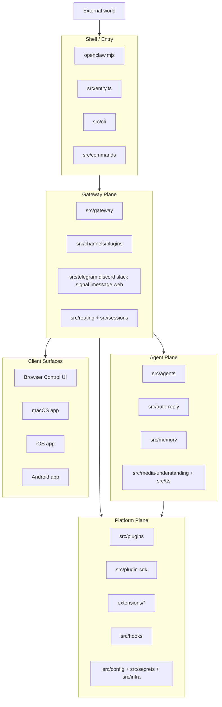
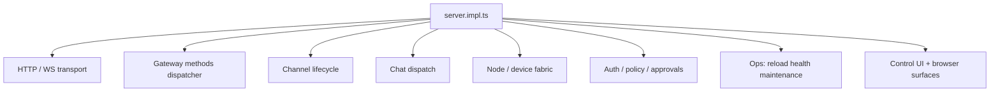
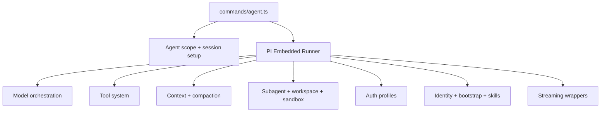

# OpenClaw 详细模块拆解

这份文档继续往下拆，但仍然遵循一个原则：

- 按“稳定职责边界”拆
- 不按零散文件名罗列
- 优先描述调用关系、依赖方向、职责中心

---

## 1. 顶层系统图

---

## 2. Shell / Entry 层

### 2.1 `openclaw.mjs`

职责：

- 校验 Node 版本
- 启用 compile cache
- 跳到构建产物 `dist/entry.*`

定位：

- 纯启动外壳
- 不参与业务

### 2.2 `src/entry.ts`

职责：

- 处理 CLI 主入口
- 标准化环境变量
- 处理 Windows argv
- 处理 `help/version`
- 处理 respawn 策略
- 最终进入 `src/cli/run-main.js`

定位：

- 真正的 TypeScript 入口
- 把“运行环境问题”挡在业务代码之外

### 2.3 `src/cli`

职责：

- Commander/argv 层
- 把命令行输入变成标准命令执行
- 管 profile、daemon、gateway-cli、nodes-cli、update-cli

定位：

- 这是 UI shell，不是核心 domain

### 2.4 `src/commands`

职责：

- 每个命令的应用层实现
- 典型命令：
  - `agent`
  - `channels`
  - `gateway-status`
  - `doctor`
  - `onboard`
  - `models`
  - `status-all`

定位：

- 这是 OpenClaw 的 CLI application services
- 也是 CLI 与内部 runtime 的主要桥梁

---

## 3. Gateway Plane 总拆解

`src/gateway` 可以拆成 8 个稳定模块。

### 3.1 启动装配模块

核心文件：

- `src/gateway/server.impl.ts`

职责：

- 加载配置
- 构造 auth limiter
- 初始化 plugin runtime
- 加载 gateway plugins
- 启动 channel manager
- 挂接 ws/http handlers
- 启动 cron / maintenance / discovery / sidecars / heartbeat / tailscale

为什么重要：

- 这里是整个 gateway 的 composition root
- 它本身不是“功能模块”，而是“模块装配器”

### 3.2 Transport 模块

相关文件：

- `src/gateway/server-http.ts`
- `src/gateway/server-browser.ts`
- `src/gateway/control-ui.ts`
- `src/gateway/openai-http.ts`
- `src/gateway/openresponses-http.ts`
- `src/gateway/http-common.ts`
- `src/gateway/http-endpoint-helpers.ts`

职责：

- 暴露 HTTP API
- 暴露 WebSocket gateway
- 承载 browser / control UI 请求
- 暴露 OpenAI/OpenResponses 兼容接口

内部可再拆：

#### 3.2.1 通用 HTTP 基础

- 路由前处理
- request context
- endpoint helper
- auth helper

#### 3.2.2 控制面 UI

- `control-ui.ts`
- `control-ui-routing.ts`
- `control-ui-csp.ts`

职责：

- 提供本地控制前端
- 管路由、静态资源、CSP、安全 origin

#### 3.2.3 OpenAI 兼容面

- `openai-http.ts`
- `openresponses-http.ts`

职责：

- 把 OpenClaw 内部 agent/chat 能力映射成标准 OpenAI 风格接口

### 3.3 Gateway Methods 分发模块

关键文件：

- `src/gateway/server-methods.ts`
- `src/gateway/server-methods-list.ts`
- `src/gateway/server-methods/*`

`server-methods.ts` 做的事情很明确：

- 校验 method 权限
- 套 request scope
- 取 handler
- 调用对应 capability handler

也就是说，这里本质是一个 RPC dispatch 层。

#### 3.3.1 方法族拆分

可以按语义分成 11 组：

##### A. 连接与健康

- `connect.ts`
- `health.ts`
- `logs.ts`

职责：

- 建立连接
- 返回健康信息
- 获取日志/尾流

##### B. Chat / Agent

- `chat.ts`
- `agent.ts`
- `agent-job.ts`
- `agent-wait-dedupe.ts`
- `agents.ts`

职责：

- 聊天消息入口
- 单次 agent 调用
- agent job/wait
- agent 列表、创建、更新、删除

##### C. Channels

- `channels.ts`
- `send.ts`
- `web.ts`
- `push.ts`

职责：

- 读取渠道状态
- 发消息
- 渠道侧功能桥接

##### D. Nodes / Devices

- `nodes.ts`
- `nodes.helpers.ts`
- `nodes-pending.ts`
- `devices.ts`

职责：

- 管 node 列表、能力、invoke
- 管 pending work 队列
- 管设备配对与 token

##### E. Config / Secrets / Skills

- `config.ts`
- `secrets.ts`
- `skills.ts`

职责：

- 读改配置
- 解析密钥
- 管 skills 安装/状态/更新

##### F. System / Update / Usage

- `system.ts`
- `update.ts`
- `usage.ts`
- `doctor.ts`

职责：

- 系统级状态与动作
- 更新
- 用量统计
- 诊断

##### G. Sessions

- `sessions.ts`

职责：

- 会话列表
- 预览
- patch/reset/delete/compact

##### H. Cron / Wizard / Voice

- `cron.ts`
- `wizard.ts`
- `voicewake.ts`
- `tts.ts`
- `talk.ts`

职责：

- 自动化任务
- onboarding 向导
- 语音唤醒
- TTS
- talk mode

##### I. Browser

- `browser.ts`

职责：

- 通过 gateway 请求 browser 行为

##### J. Tools Catalog

- `tools-catalog.ts`

职责：

- 对外暴露可用工具目录

##### K. Policy / Validation 辅助

- `validation.ts`
- `attachment-normalize.ts`
- `chat-transcript-inject.ts`
- `base-hash.ts`

职责：

- 规范化输入
- 注入 transcript 相关上下文
- 做安全和一致性处理

#### 3.3.2 这个模块为什么是核心

因为它把 gateway 从“HTTP server”提升成了“capability bus”。

换句话说：

- transport 只是入口
- `server-methods/*` 才是 gateway 的业务 API 面

### 3.4 Channel Lifecycle 模块

关键文件：

- `src/gateway/server-channels.ts`
- `src/gateway/channel-health-monitor.ts`
- `src/gateway/channel-status-patches.ts`

职责：

- 启停 channel account
- 做 restart/backoff
- 维护 runtime snapshot
- 输出 channels.status 所需状态

内部结构：

#### 3.4.1 生命周期控制

- `startChannels`
- `startChannel`
- `stopChannel`

#### 3.4.2 状态存储

- account runtime status
- abort controllers
- current tasks

#### 3.4.3 健康与恢复

- auto restart
- restart attempts
- manual stop 保护

依赖对象：

- `src/channels/plugins/index.ts`
- 各 channel plugin 的 `gateway.startAccount`

### 3.5 Chat Dispatch 模块

关键文件：

- `src/gateway/server-chat.ts`
- `src/gateway/chat-attachments.ts`
- `src/gateway/chat-sanitize.ts`
- `src/gateway/chat-abort.ts`

职责：

- 接收 chat send/history/abort
- 规范化用户消息
- 转换附件
- 驱动 agent/chat 流程

定位：

- 这是 gateway 到 agents 的主业务桥

### 3.6 Node / Device Fabric 模块

关键文件：

- `src/gateway/node-registry.ts`
- `src/gateway/server-discovery-runtime.ts`
- `src/gateway/server-discovery.ts`
- `src/gateway/server-node-subscriptions.ts`
- `src/gateway/server-mobile-nodes.ts`

职责：

- 管远端节点
- 管连接、订阅、广播
- 管 invoke/request-result/pending-work
- 管 mobile/browser/control 节点能力

说明：

- 这部分让 OpenClaw 不再只是单进程 CLI
- 它有明显的“分布式 agent fabric”倾向

### 3.7 Auth / Policy / Approval 模块

关键文件：

- `src/gateway/auth.ts`
- `src/gateway/startup-auth.ts`
- `src/gateway/connection-auth.ts`
- `src/gateway/role-policy.ts`
- `src/gateway/method-scopes.ts`
- `src/gateway/exec-approval-manager.ts`

职责：

- 建连鉴权
- role + scope 鉴权
- control-plane write 限流
- exec approval 生命周期

这层回答的是：

- 谁能连进来
- 谁能调哪些 method
- 哪些命令需要人工批准

### 3.8 Ops 模块

关键文件：

- `src/gateway/config-reload.ts`
- `src/gateway/server-maintenance.ts`
- `src/gateway/probe.ts`
- `src/gateway/server-model-catalog.ts`

职责：

- 热重载配置
- 维护后台任务
- 运行探针
- 聚合模型目录

定位：

- 这层是 gateway 的“运维底座”

---

## 4. Channel Plugin Plane 详细拆解

这个模块被低估了。实际上它是 OpenClaw 的渠道抽象核心。

### 4.1 关键结论

OpenClaw 并不是直接把 Telegram/Slack/Discord 写死在系统里。

它更像是：

- 定义统一 channel contract
- 让内建渠道和外部扩展都实现这个 contract
- gateway 只依赖 contract，不依赖具体渠道细节

### 4.2 中心文件

- `src/channels/plugins/types.plugin.ts`
- `src/channels/plugins/index.ts`
- `src/channels/plugins/load.ts`
- `src/channels/plugins/catalog.ts`
- `src/channels/plugins/registry-loader.ts`

### 4.3 `ChannelPlugin` contract 可以拆成哪些面

从 `types.plugin.ts` 看，单个渠道插件可实现这些 facet：

#### A. 元数据面

- `id`
- `meta`
- `capabilities`

表示：

- 这是什么渠道
- 它在 UI/文档里怎么展示
- 它有哪些能力

#### B. 配置面

- `config`
- `configSchema`
- `setup`

表示：

- 怎么读写此渠道配置
- 怎么展示 schema
- 怎么做 setup

#### C. 运行时面

- `gateway`
- `status`
- `outbound`
- `auth`
- `elevated`

表示：

- 如何启动 account runtime
- 如何报告状态
- 如何发送消息
- 如何登录/鉴权
- 是否需要高权限操作

#### D. 消息语义面

- `commands`
- `streaming`
- `threading`
- `messaging`
- `actions`
- `mentions`
- `groups`
- `resolver`

表示：

- 是否支持命令
- 是否支持流式回复
- 是否支持线程/topic
- 如何解目标、群组、mention、message action

#### E. 配对与 onboarding 面

- `pairing`
- `onboarding`
- `heartbeat`

表示：

- 如何配对
- 如何向导配置
- 如何做 heartbeat 机制

#### F. Agent 扩展面

- `agentPrompt`
- `agentTools`

表示：

- 渠道可以影响 agent prompt
- 渠道可以暴露自己的 agent tools

### 4.4 这个模块内部还能拆成 7 块

#### 4.4.1 Registry / Loading

- `index.ts`
- `load.ts`
- `registry-loader.ts`

职责：

- 加载插件
- 做缓存
- 提供按 id 查找

#### 4.4.2 Catalog / UI Meta

- `catalog.ts`

职责：

- 发现可安装 channel plugins
- 生成 UI catalog

#### 4.4.3 Config / Schema / Writes

- `config-helpers.ts`
- `config-schema.ts`
- `config-writes.ts`

职责：

- 统一渠道配置读写和 schema 生成

#### 4.4.4 Normalize / Resolve

- `normalize/*`
- `directory-config.ts`
- `helpers.ts`

职责：

- 统一 normalize 各渠道目标、peer、message id
- 支撑目录与目标解析

#### 4.4.5 Outbound

- `outbound/*`
- `message-actions.ts`
- `actions/*`

职责：

- 构造各渠道发送 payload
- 处理 reaction、reply、message action

#### 4.4.6 Onboarding / Pairing

- `onboarding/*`
- `pairing.ts`
- `pairing-message.ts`

职责：

- 渠道 onboarding 流程
- 配对与接入说明

#### 4.4.7 Status / Policy

- `status.ts`
- `status-issues/*`
- `group-policy-warnings.ts`
- `account-action-gate.ts`

职责：

- 渠道健康、错误、组策略警告

### 4.5 真正的渠道实现层

`src/telegram`, `src/discord`, `src/slack`, `src/signal`, `src/imessage`, `src/web`

这些目录是具体驱动层，负责：

- 实际 SDK / API / socket / webhook 交互
- inbound 监听
- outbound 发送
- 登录与会话恢复

而 `src/channels/plugins/*` 是它们上面的统一抽象层。

---

## 5. Agent Plane 总拆解

`src/agents` 可以拆成 10 个子系统。

### 5.1 Agent 入口与编排

关键文件：

- `src/commands/agent.ts`
- `src/agents/cli-runner.ts`
- `src/agents/pi-embedded.ts`

职责：

- 接收 agent 调用
- 选 sessionKey / sessionId / agentId
- 处理发送回路、会话持久化、transcript
- 准备 workspace、model fallback、auth profile override
- 调用 `runEmbeddedPiAgent`

这层本质是 agent application service。

### 5.2 PI Embedded Runner 执行引擎

这是 OpenClaw 最核心的一层。

关键文件：

- `src/agents/pi-embedded-runner/run.ts`
- `src/agents/pi-embedded-runner/run/attempt.ts`
- `src/agents/pi-embedded-runner/runs.ts`

#### 5.2.1 `run.ts` 负责什么

从 import 和主流程看，它承担了这些职责：

- lane queue 管理
- workspace 解析
- runtime plugins 装载
- model/provider 解析
- auth profile 选择与失败标记
- failover 主循环
- usage 汇总
- compaction retry
- oversized tool result 截断

也就是说，`run.ts` 是 orchestration loop。

#### 5.2.2 `run/attempt.ts` 负责什么

职责：

- 构造单次模型调用 attempt
- 组合 system prompt
- 注入 hooks 结果
- 构造 payload
- 实际执行一次流式/非流式模型调用
- 处理 tool-call roundtrip

也就是说：

- `run.ts` = 外层重试与编排
- `run/attempt.ts` = 单次推理 attempt 执行

#### 5.2.3 `runs.ts` 负责什么

职责：

- 跟踪当前活动 run
- abort run
- queue message
- wait for end

这是 execution state registry。

### 5.3 Model Orchestration 子系统

关键文件：

- `src/agents/pi-embedded-runner/model.ts`
- `src/agents/model-auth.ts`
- `src/agents/model-selection.ts`
- `src/agents/model-catalog.ts`
- `src/agents/model-fallback.ts`
- `src/agents/models-config.ts`
- `src/agents/models-config.providers.ts`

可以再拆成 5 层：

#### 5.3.1 模型发现层

- `model-catalog.ts`
- `models-config.providers.ts`
- 各 provider discovery 文件

职责：

- 汇总 provider/model 定义
- 自动发现可用模型

#### 5.3.2 模型选择层

- `model-selection.ts`
- `model-ref-profile.ts`

职责：

- 标准化 provider/model id
- 选默认模型
- 处理 alias / normalize

#### 5.3.3 凭证层

- `model-auth.ts`
- `auth-profiles/*`

职责：

- 找 API key
- 读 auth profile
- 处理 cooldown / good/bad profile

#### 5.3.4 配置合成层

- `models-config.ts`
- `models-config.merge.ts`

职责：

- 从 config + env + discovered models 合成 `models.json`

#### 5.3.5 Fallback 层

- `model-fallback.ts`
- `failover-error.ts`

职责：

- 在 auth、timeout、rate limit、上下文溢出等失败场景下换 provider/model/profile

这一整块其实可以独立成一个“模型路由器”项目。

### 5.4 Context / Compaction 子系统

关键文件：

- `src/agents/context.ts`
- `src/agents/compaction.ts`
- `src/agents/context-window-guard.ts`
- `src/agents/pi-embedded-runner/history.ts`
- `src/agents/pi-embedded-runner/compact.ts`

职责：

- 维护上下文窗口
- 限制历史长度
- 超窗时触发 compaction
- 控制 tool result 对上下文的污染

这个子系统是 OpenClaw 长会话可持续运行的核心。

### 5.5 Tool System 子系统

核心枢纽：

- `src/agents/openclaw-tools.ts`
- `src/agents/tool-catalog.ts`
- `src/agents/tools/*`

`openclaw-tools.ts` 说明得非常清楚：

- 核心工具由这里统一构造
- 再把 plugin tools 拼进来

#### 5.5.1 工具注册层

- `openclaw-tools.ts`
- `tool-catalog.ts`

职责：

- 组织工具集合
- 处理 profile allowlist
- 组织 section/category

#### 5.5.2 核心工具分组

从 `tool-catalog.ts` 可见，工具按这些 section 分组：

- Files
- Runtime
- Web
- Memory
- Sessions
- UI
- Messaging
- Automation
- Nodes
- Agents
- Media

这说明 OpenClaw 的 agent 已经接近一个通用操作型 agent 平台。

#### 5.5.3 `src/agents/tools/*` 可再拆成 9 类

##### A. Web / Browser / Canvas

- `browser-tool.ts`
- `web-fetch.ts`
- `web-search.ts`
- `web-tools.ts`
- `canvas-tool.ts`

##### B. Messaging / Channel Actions

- `message-tool.ts`
- `telegram-actions.ts`
- `slack-actions.ts`
- `discord-actions.ts`
- `whatsapp-actions.ts`

##### C. Sessions / Agent Coordination

- `sessions-list-tool.ts`
- `sessions-history-tool.ts`
- `sessions-send-tool.ts`
- `sessions-spawn-tool.ts`
- `subagents-tool.ts`
- `session-status-tool.ts`

##### D. Gateway / Nodes / Cron

- `gateway-tool.ts`
- `nodes-tool.ts`
- `cron-tool.ts`

##### E. Memory

- `memory-tool.ts`

##### F. Media

- `image-tool.ts`
- `pdf-tool.ts`
- `tts-tool.ts`

##### G. Agents Meta

- `agents-list-tool.ts`
- `agent-step.ts`

##### H. Helpers / Shared

- `common.ts`
- `tool-runtime.helpers.ts`
- `media-tool-shared.ts`

##### I. Security / Guarded Web Access

- `web-guarded-fetch.ts`
- `web-fetch-visibility.ts`

### 5.6 Subagent / Workspace / Sandbox 子系统

关键文件：

- `src/agents/subagent-*`
- `src/agents/workspace*.ts`
- `src/agents/sandbox/*`
- `src/agents/lanes.ts`

职责：

- 生成/管理子代理
- 维护 agent workspace
- 提供沙箱文件桥接
- 控制进程与浏览器隔离
- 控制 lane 并发

说明：

- 这一层是 OpenClaw “会操作环境”的基础
- 没有它，OpenClaw 更像聊天机器人
- 有了它，OpenClaw 更像 agent runtime OS

### 5.7 Auth Profiles 子系统

关键目录：

- `src/agents/auth-profiles/*`

职责：

- 多 profile 存储
- profile 排序
- cooldown
- oauth sync
- session override
- state observation

作用：

- 支撑 provider/model/profile 多路切换
- 给 failover 提供更细粒度的恢复路径

### 5.8 Identity / Bootstrap / Skills 子系统

关键文件：

- `src/agents/identity.ts`
- `src/agents/identity-file.ts`
- `src/agents/bootstrap-*`
- `src/agents/skills*`

职责：

- agent persona/identity
- 启动时注入 bootstrap 内容
- 维护 skill snapshot、refresh、workspace skill 上下文

这层决定 agent “像谁”和“带着什么上下文启动”。

### 5.9 Streaming Wrapper 子系统

关键文件：

- `anthropic-stream-wrappers.ts`
- `openai-stream-wrappers.ts`
- `proxy-stream-wrappers.ts`
- `moonshot-stream-wrappers.ts`
- `google.ts`

职责：

- 适配不同 provider 的 streaming 行为
- 兼容不同 tool call / reasoning / cache / thought block 格式

这层说明 OpenClaw 的 provider 抽象不是轻量封装，而是深兼容层。

### 5.10 Session / Run Supporting 子系统

关键文件：

- `session-manager-init.ts`
- `session-manager-cache.ts`
- `tool-result-truncation.ts`
- `tool-result-context-guard.ts`
- `thinking.ts`
- `usage-reporting.ts`

职责：

- 初始化 session manager
- 控制 tool result 对上下文和 transcript 的影响
- thinking 级别控制
- usage 归集与上报

---

## 6. Routing / Session / State Plane

这一层虽然分散，但其实是一个独立系统。

关键目录：

- `src/routing`
- `src/sessions`
- `src/config/sessions`

### 6.1 路由核心

关键文件：

- `src/routing/session-key.ts`

职责：

- 统一 session key 规则
- 从 agent/channel/account/peer/thread 生成可寻址 key

这是 OpenClaw 的会话寻址协议。

### 6.2 会话状态

职责：

- 存储 session entry
- 管 transcript
- 维护 level/model/send-policy override

### 6.3 为什么它重要

OpenClaw 能支持：

- 多 agent
- 多 account
- 多渠道
- 群聊 / direct / thread

靠的不是各模块自己记状态，而是统一 session key + session store。

---

## 7. Plugins / SDK / Extensions Plane

### 7.1 `src/plugins`

职责：

- plugin registry
- hook runner
- plugin discovery
- tool/runtime integration

### 7.2 `src/plugins/runtime`

职责：

- 给插件暴露受控 runtime：
  - config
  - system
  - media
  - tools
  - channel
  - events
  - logging
  - state
  - modelAuth

关键点：

- 插件不是任意访问核心
- 而是通过 runtime facade 受控进入

### 7.3 `src/plugin-sdk`

职责：

- 对外提供稳定 API 面
- 支持 channel、memory、diagnostics、voice、auth 等扩展

### 7.4 `extensions/*`

职责：

- 真正的外部功能包
- 包括 channel 类扩展、auth/provider 类扩展、memory/tool 类扩展

定位：

- 这是 OpenClaw 平台化的外延

---

## 8. Media / Memory / Auto Reply Plane

这些不是最大模块，但很关键。

### 8.1 `src/auto-reply`

职责：

- 处理自动回复逻辑
- 常和 channel inbound/monitor 流程耦合

### 8.2 `src/memory`

职责：

- memory backend 与记忆检索

### 8.3 `src/media` + `src/media-understanding` + `src/tts`

职责：

- 媒体处理
- 语音转文字
- 文字转语音
- 图片/PDF 理解相关能力接入

---

## 9. Apps / Client Surface

目录：

- `apps/macos`
- `apps/ios`
- `apps/android`
- `apps/shared`

定位：

- 这些不是核心执行引擎
- 而是 OpenClaw runtime 的多端控制面与交互面

换句话说：

- runtime 在 core
- app 是壳和控制界面

---

## 10. 最终拆解结论

如果你要把 OpenClaw “拆开重讲”，最合理的讲法不是按目录树，而是按这 6 层：

1. Entry Shell
2. Gateway Service Container
3. Channel Plugin Abstraction
4. Agent Execution Kernel
5. Session/State Addressing System
6. Plugin/SDK Platform

再压缩成一句话：

**OpenClaw = 多渠道接入层 + 网关编排层 + Agent 执行内核 + 插件平台 + 统一会话状态系统。**

---

## 11. 下一轮继续拆什么最有价值

如果还要继续往下拆，建议顺序是：

1. `src/gateway/server-methods/*` 按 method map 逐项归类
2. `src/agents/pi-embedded-runner/*` 画执行时序图
3. `src/agents/tools/*` 画工具注册与权限模型
4. `src/channels/plugins/*` 画 channel contract 与实际渠道实现的关系图
