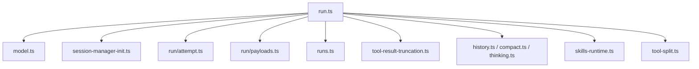
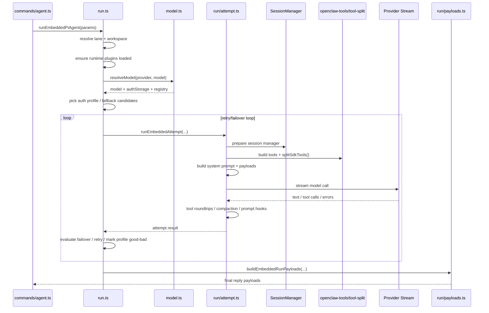

# OpenClaw `pi-embedded-runner` 执行时序

这份文档只拆一个核心：

- `src/agents/pi-embedded-runner/*`

它是 OpenClaw 真正的执行内核。

---

## 1. 一句话定义

`pi-embedded-runner` 是一个 **带重试、带 fallback、带工具回路、带上下文压缩、带 provider 兼容层的 agent 执行引擎**。

---

## 2. 主文件职责图

---

## 3. 最关键的角色分工

### `run.ts`

外层 orchestrator。

负责：

- 整个 run 生命周期
- lane queue
- workspace 解析
- plugins runtime 加载
- model/provider/profile 解析
- failover 主循环
- usage 汇总
- oversized tool result 修正

### `run/attempt.ts`

单次 attempt 执行器。

负责：

- 构造 system prompt
- 处理 bootstrap/skills/hooks
- 准备 session manager
- 准备工具集
- 准备 payload
- 进行一次模型流式执行
- 处理 tool call 循环

### `model.ts`

模型解析层。

负责：

- provider/model 解析
- inline provider 配置合成
- forward-compat fallback
- auth storage / model registry 组装

### `run/payloads.ts`

输出整形层。

负责：

- 把 assistant text / tool metas / reasoning / error
- 组合成最终 reply payloads

### `runs.ts`

运行状态注册表。

负责：

- active run 跟踪
- abort
- wait end
- queue embedded messages

### `session-manager-init.ts`

会话文件修复层。

负责：

- 修补 `SessionManager` 的持久化怪癖
- 确保首次 user message 不会因为文件状态异常而丢失

这是非常典型的“外部库兼容修补层”。

---

## 4. 执行时序图

---

## 5. 真正的执行阶段

### 阶段 1. 入口标准化

发生在 `run.ts`。

内容：

- 选 session lane / global lane
- 选 workspace
- 归一化 provider/model/toolResultFormat
- 确保 runtime plugins 已加载

这一阶段决定“这次 run 在什么执行环境里发生”。

### 阶段 2. 模型解析

发生在 `model.ts`。

内容：

- 读 config 里的 provider/model 配置
- 查询 model registry
- 尝试 inline provider models
- 尝试 forward-compat fallback
- 特判如 OpenRouter 这类 pass-through provider

产物：

- resolved model
- auth storage
- model registry

### 阶段 3. 外层失败恢复准备

发生在 `run.ts`。

内容：

- 构造 auth profile 候选序列
- 计算最大 retry iterations
- 准备 usage accumulator
- 准备 failover observation

这里体现出 OpenClaw 不是“一次请求一次返回”，而是：

- 一个会主动寻找可运行路径的执行器

### 阶段 4. 单次 attempt 初始化

发生在 `run/attempt.ts`。

内容：

- 准备 session file / session manager
- 调 `prepareSessionManagerForRun`
- 预热 session file
- 修复 transcript/tool result pairing
- 加 session write lock

这个阶段的目标是：

- 先把会话状态变成“可安全执行”的状态

### 阶段 5. Prompt 构造

发生在 `run/attempt.ts`。

内容：

- resolve bootstrap context
- resolve skills prompt
- apply hooks: `before_prompt_build` / legacy `before_agent_start`
- build system prompt
- build docs path / owner display / channel capability hints / TTS hints

这里说明 system prompt 不是静态模板，而是多来源合成：

- bootstrap
- skills
- hooks
- channel
- runtime state

### 阶段 6. 工具装载

主要来自：

- `src/agents/openclaw-tools.ts`
- `tool-split.ts`
- `run/attempt.ts`

内容：

- 构造 core tools
- 追加 plugin tools
- 过滤 allowlist
- 适配为 provider/SDK 可消费的 tool definitions

关键点：

- `tool-split.ts` 当前明确把工具都走 `customTools`
- 不走 provider built-in tools

这意味着 OpenClaw 有意把工具策略和兼容层握在自己手里。

### 阶段 7. Provider Stream 执行

发生在 `run/attempt.ts`。

内容：

- 选择 stream fn
- provider wrapper 适配
- 校验 turn 格式
- 流式接收文本 / tool calls / reasoning block
- 处理 provider-specific compatibility

相关兼容层包括：

- `anthropic-stream-wrappers.ts`
- `openai-stream-wrappers.ts`
- `proxy-stream-wrappers.ts`
- `moonshot-stream-wrappers.ts`
- `google.ts`

### 阶段 8. Tool Roundtrip

发生在 `run/attempt.ts` 内部。

内容：

- 模型发起 tool call
- 运行工具
- 把结果回注会话
- 必要时截断或清洗 tool result
- 再次进入模型

这是 agent 能“行动”的关键闭环。

### 阶段 9. Compaction / Overflow Recovery

相关文件：

- `compact.ts`
- `run/compaction-timeout.ts`
- `run/compaction-retry-aggregate-timeout.ts`
- `tool-result-truncation.ts`
- `history.ts`

内容：

- 上下文过大时压缩
- 图片历史裁剪
- tool result 截断
- compaction 超时保护

这是长会话稳定性的关键补偿系统。

### 阶段 10. 外层 Failover

回到 `run.ts`。

内容：

- 判断错误类型
- 标记 auth profile good/bad
- 判断是否换 profile/provider/model
- backoff 重试
- 终止或进入下一次 attempt

这一步让 OpenClaw 的 runner 具备“自恢复”特征。

### 阶段 11. 结果成型

相关文件：

- `run/payloads.ts`

内容：

- 汇总 assistant texts
- 汇总 tool meta
- 处理 reasoning 显示
- 处理 raw error / user-facing error 去重
- 生成最终消息 payloads

这一步相当于 UI-facing result assembler。

---

## 6. 内部子系统拆解

### 6.1 会话安全子系统

相关文件：

- `session-manager-init.ts`
- `session-manager-cache.ts`
- `session-write-lock.ts`
- `session-file-repair.ts`
- `session-tool-result-guard-wrapper.ts`
- `session-transcript-repair.ts`

职责：

- 保护 transcript 一致性
- 防止 session file 被外部库写坏
- 防止 tool result 结构污染会话

### 6.2 Prompt 合成子系统

相关文件：

- `system-prompt.ts`
- `skills-runtime.ts`
- `bootstrap-*`
- `run/attempt.ts`

职责：

- 组装 system prompt
- 注入 skills/bootstrap/channel/runtime context

### 6.3 Provider 兼容子系统

相关文件：

- `model.ts`
- `model.provider-normalization.ts`
- `proxy-stream-wrappers.ts`
- `google.ts`
- `openai-stream-wrappers.ts`
- `anthropic-stream-wrappers.ts`

职责：

- 兼容不同 provider 的 schema、streaming、tool-call 行为

### 6.4 Tool 安全子系统

相关文件：

- `tool-name-allowlist.ts`
- `tool-result-context-guard.ts`
- `tool-result-truncation.ts`
- `tool-split.ts`

职责：

- 限制可调用工具
- 保护 tool result 不污染上下文
- 控制 provider 能看到的 tool surface

### 6.5 Run 状态子系统

相关文件：

- `runs.ts`
- `abort.ts`
- `wait-for-idle-before-flush.ts`
- `usage-reporting.ts`

职责：

- 跟踪活动 run
- 提供 abort/wait
- 在空闲点 flush 结果
- 汇总 usage

---

## 7. 它为什么复杂

因为它同时在解决 5 个问题：

1. 模型调用
2. 工具调用
3. 会话持久化
4. provider 差异兼容
5. 长上下文稳定性

普通 agent 项目通常只做第 1 项。

OpenClaw 的 `pi-embedded-runner` 是把这 5 项叠在一起了。

---

## 8. 如果要继续拆包，最合理的拆法

可以把 `pi-embedded-runner` 再拆成这些包：

1. `runner-core`
   - `run.ts`
   - `runs.ts`
   - `abort.ts`
2. `runner-attempt`
   - `run/attempt.ts`
   - `run/payloads.ts`
   - `run/types.ts`
3. `runner-session`
   - `session-manager-init.ts`
   - session cache/repair/lock
4. `runner-provider-compat`
   - wrappers
   - provider normalization
   - model resolve glue
5. `runner-context`
   - history
   - compact
   - tool-result truncation/guards
6. `runner-prompt`
   - system prompt
   - bootstrap
   - skills runtime

---

## 9. 最终判断

`pi-embedded-runner` 不是简单的“调用 LLM 的函数”。

它更像：

**OpenClaw 的微型执行内核。**

如果 `gateway` 是 system shell，
那 `pi-embedded-runner` 就是：

- scheduler
- prompt builder
- provider adapter
- tool loop engine
- transcript repair layer
- failover controller

的合体。
