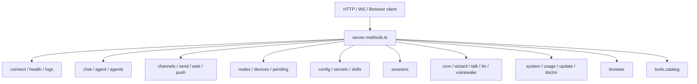
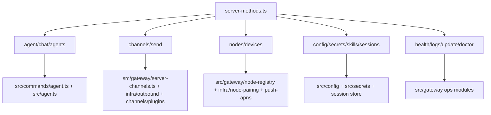

# OpenClaw Gateway `server-methods` 地图

这份文档专门拆 `src/gateway/server-methods/*`。

目标：

- 搞清楚 gateway 实际对外暴露了什么能力
- 理清这些 method 属于哪类服务
- 看清它们和 `agents` / `channels` / `nodes` / `config` 的关系

---

## 1. 这层到底是什么

`src/gateway/server-methods.ts` 本质上是一个 RPC dispatcher。

它做 4 件事：

1. 校验 method 权限
2. 做 role/scope 校验
3. 套 request scope
4. 调用对应 handler

所以：

- HTTP / WS 只是 transport
- `server-methods/*` 才是 gateway 的真正 API 面

---

## 2. 总体结构

---

## 3. Method 家族拆解

### 3.1 连接与基础观测

#### `connect.ts`

主要职责：

- 建立 gateway 连接上下文
- 处理 connect 相关挑战/握手
- 绑定 client metadata

这是所有有状态 gateway 调用的入口。

#### `health.ts`

主要职责：

- 返回 gateway 健康快照
- 作为最低权限 method 存在

这是最基础的探针接口。

#### `logs.ts`

主要职责：

- 输出/尾随日志

这是控制面观测接口。

---

### 3.2 Chat 面

#### `chat.ts`

这是 WebChat / UI 聊天的主入口。

主要能力：

- `chat.send`
- `chat.history`
- `chat.abort`
- transcript 注入
- 附件解析
- 路由继承
- stop-command 处理

它连接的下游包括：

- `auto-reply`
- session transcript
- agent/chat 执行
- outbound delivery context

它更像“面向 UI 的会话聊天服务”。

#### `chat-transcript-inject.ts`

职责：

- 向会话 transcript 注入系统/助手消息

#### `attachment-normalize.ts`

职责：

- 把 RPC 附件输入规范化为内部附件结构

---

### 3.3 Agent 面

#### `agent.ts`

这是 gateway 发起 agent 运行的主入口。

主要职责：

- 校验 `agent` 请求参数
- 标准化 sessionKey / agentId / spawned metadata
- 解析消息和图片附件
- 处理 `/new`、`/reset`
- 设 dedupe / idempotency
- 调用 `agentCommandFromIngress`
- 等待或分发异步完成结果

这层的定位不是“执行 agent”，而是：

- **把 gateway 请求翻译成 agent ingress**

#### `agent-job.ts`

职责：

- 等待 agent job 完成

#### `agent-wait-dedupe.ts`

职责：

- 去重等待结果
- 缓存 terminal snapshot

#### `agent-timestamp.ts`

职责：

- 生成/注入 agent 时间戳相关元数据

#### `agents.ts`

职责：

- `agents.list`
- `agents.create`
- `agents.update`
- `agents.delete`
- `agents.files.*`

这组方法不是“run agent”，而是“管理 agent 实体”。

所以 `agent.ts` 和 `agents.ts` 的差别是：

- `agent.ts` = 执行
- `agents.ts` = 管理

---

### 3.4 Channels / Send 面

#### `channels.ts`

职责：

- 返回渠道状态
- 登出渠道
- 触达 channel manager 层

这是 channel lifecycle 的控制面。

#### `send.ts`

职责：

- 发送显式 outbound 消息
- 解析 channel / account / target
- 调用 outbound plugin
- 需要时自动推导会话路由

这层更像显式 “send API”。

从代码看它依赖：

- `infra/outbound/channel-resolution`
- `infra/outbound/targets`
- `infra/outbound/deliver`
- `infra/outbound/outbound-session`

所以它其实是 outbound service façade。

#### `web.ts`

职责：

- 面向 web channel/WhatsApp Web 相关 gateway 能力

#### `push.ts`

职责：

- push 相关桥接能力

---

### 3.5 Nodes / Devices 面

#### `nodes.ts`

这是节点系统的主接口，复杂度很高。

主要职责：

- node list / describe / rename
- node pairing request/approve/reject/verify
- node invoke
- node event
- canvas capability refresh
- APNS wake
- pending foreground action queue

这个文件说明 gateway 已经不仅是消息入口，还负责：

- 远端节点执行
- 设备唤醒
- 节点命令路由

#### `nodes-pending.ts`

职责：

- node pending pull / ack / enqueue / drain

它是 node command queue 的控制接口。

#### `nodes.helpers.ts`

职责：

- 节点响应辅助
- invoke 错误统一处理
- JSON parse 等共用逻辑

#### `nodes.handlers.invoke-result.ts`

职责：

- 处理 node.invoke 返回结果

#### `devices.ts`

职责：

- 设备配对与 token 生命周期

这说明 node 和 device 在 OpenClaw 里是两个紧邻但不同的概念：

- node 更像运行实体
- device 更像认证/配对实体

---

### 3.6 Config / Secrets / Skills 面

#### `config.ts`

职责：

- `config.get/set/apply/patch/schema`

这是系统配置控制面。

#### `secrets.ts`

职责：

- secrets reload
- secrets resolve

这是运行时密钥控制面。

#### `skills.ts`

职责：

- skills status / bins / install / update

这是 skill 生命周期管理面。

---

### 3.7 Sessions 面

#### `sessions.ts`

职责：

- `sessions.list`
- `sessions.preview`
- `sessions.patch`
- `sessions.reset`
- `sessions.delete`
- `sessions.compact`

这是 session store 的管理接口。

它是 gateway 对统一会话系统的直接控制面。

---

### 3.8 Automation / Voice / Wizard 面

#### `cron.ts`

职责：

- `cron.list/status/add/update/remove/run/runs`

是自动化任务控制面。

#### `wizard.ts`

职责：

- 向导流程启动/推进/取消/状态

#### `voicewake.ts`

职责：

- 语音唤醒配置读写

#### `tts.ts`

职责：

- TTS 状态、provider、enable/disable、convert

#### `talk.ts`

职责：

- talk mode/config

---

### 3.9 System / Usage / Update / Doctor 面

#### `system.ts`

职责：

- system 级事件和状态

#### `usage.ts`

职责：

- 用量和成本统计

#### `update.ts`

职责：

- 触发更新流程

#### `doctor.ts`

职责：

- 运行诊断逻辑

这是 gateway 的运维控制面。

---

### 3.10 Browser / Tools Catalog 面

#### `browser.ts`

职责：

- browser.request 等桥接

#### `tools-catalog.ts`

职责：

- 对外输出工具目录

这让外部 client 能知道 agent runtime 具备哪些工具能力。

---

## 4. Method 按“后端类型”再分一次

如果不按业务，而按它们最终操作的后端类型，可以分成 5 类：

### A. 操作 `agents`

- `agent.ts`
- `agents.ts`
- `chat.ts`

### B. 操作 `channels/outbound`

- `channels.ts`
- `send.ts`
- `web.ts`
- `push.ts`

### C. 操作 `nodes/devices`

- `nodes.ts`
- `nodes-pending.ts`
- `devices.ts`

### D. 操作 `config/session/skills/secrets`

- `config.ts`
- `sessions.ts`
- `skills.ts`
- `secrets.ts`

### E. 操作 `gateway ops`

- `health.ts`
- `logs.ts`
- `doctor.ts`
- `usage.ts`
- `update.ts`
- `wizard.ts`
- `voicewake.ts`
- `tts.ts`
- `talk.ts`

---

## 5. 调用方向图

---

## 6. 最终结论

`server-methods/*` 不是零散 handler 集合，而是 OpenClaw 的 **control-plane API surface**。

如果你要重构或拆包，这层最合理的拆法是：

1. `gateway-api-core`
   - connect
   - health
   - logs
   - auth/validation helpers
2. `gateway-api-agent`
   - agent
   - agents
   - chat
   - sessions
3. `gateway-api-messaging`
   - channels
   - send
   - web
   - push
4. `gateway-api-nodes`
   - nodes
   - devices
   - pending
5. `gateway-api-ops`
   - config
   - secrets
   - skills
   - doctor
   - update
   - usage
   - wizard
   - talk
   - tts
   - voicewake

---

## 7. 我对这层的判断

OpenClaw 的 gateway 本质不是 REST server，而是：

**一个围绕 method name 驱动的能力总线。**

这也是为什么它后续很容易继续扩展：

- 新 transport 可以接同一组 methods
- 新 client 也可以接同一组 methods
- 新 node/device surface 也能共享这层能力编排
